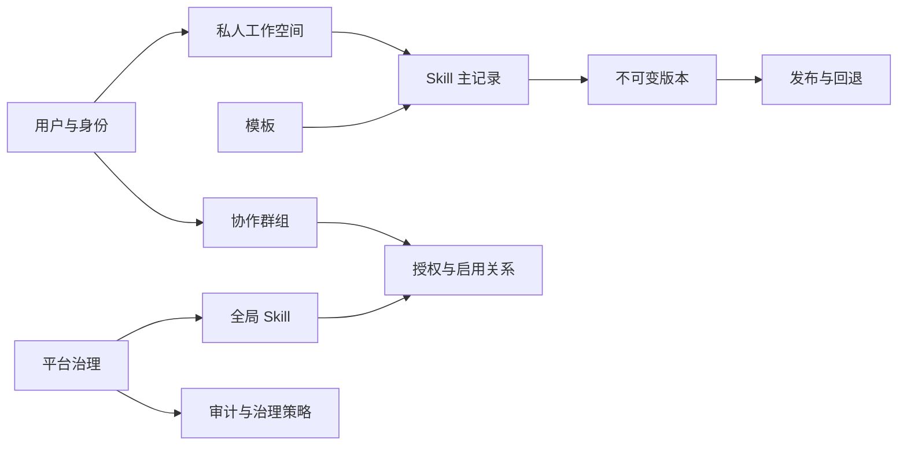
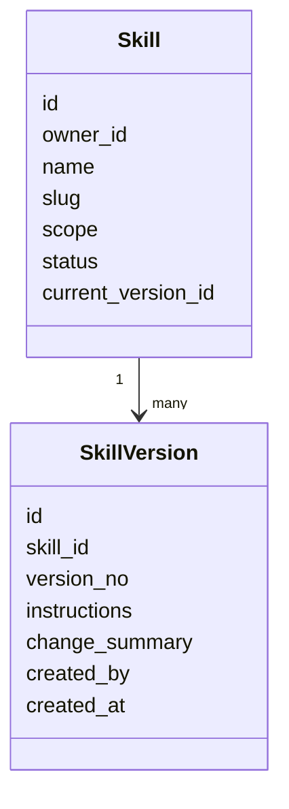
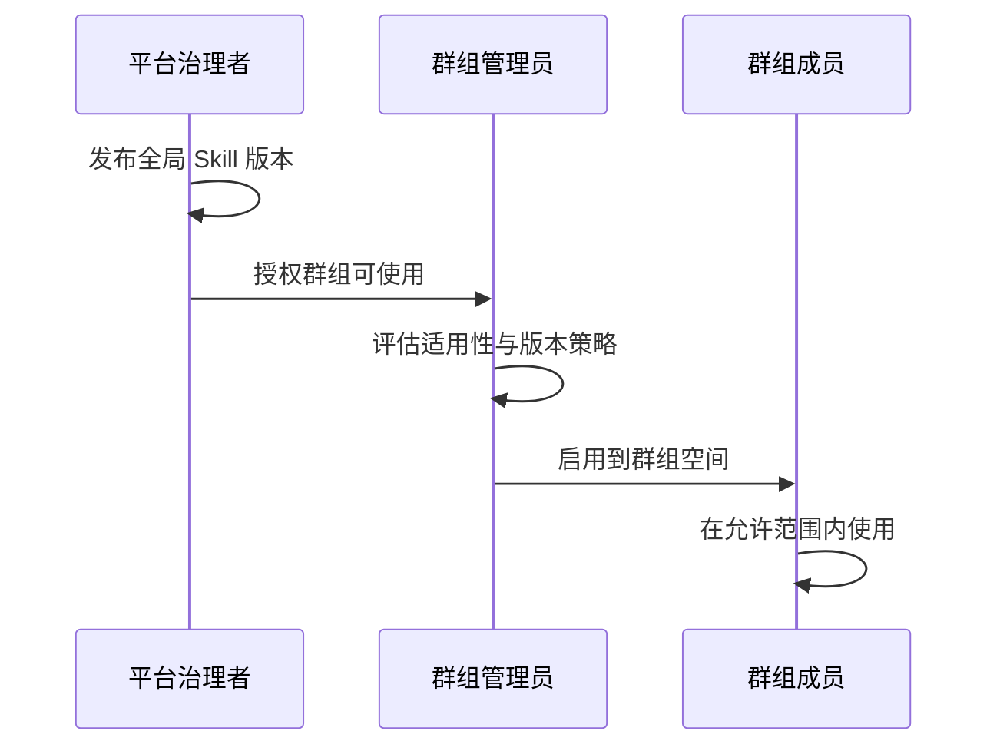
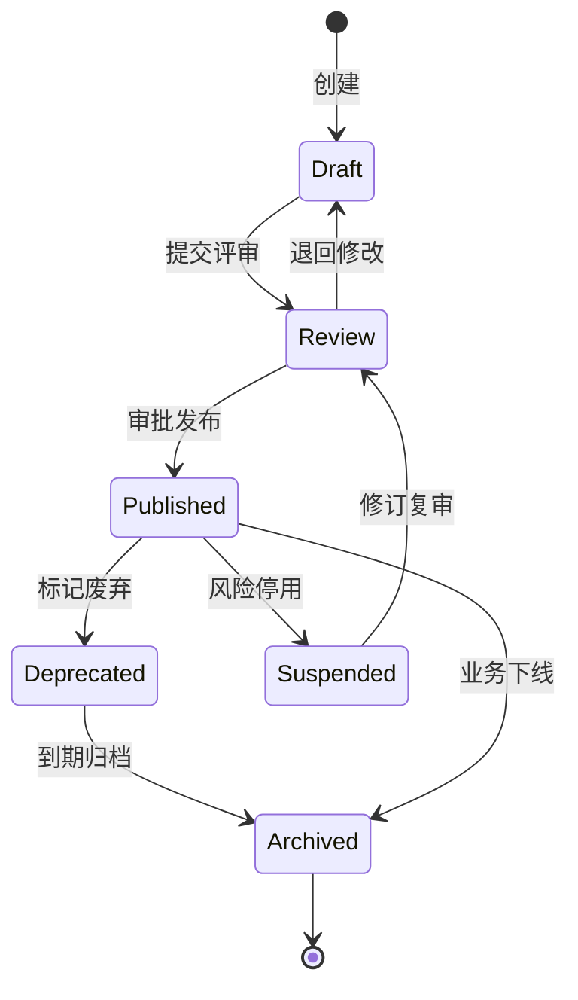
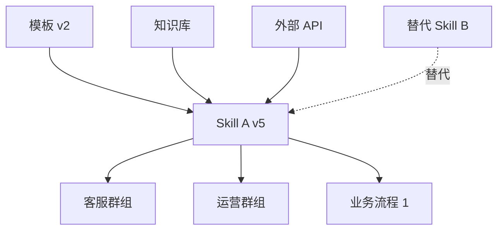
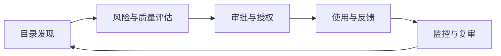

Agent 项目通常会沉淀一批可复用的 Skill。它们可能是提示词、操作步骤、脚本说明，也可能是一套完整的任务处理规范。个人使用时，把文件保存在本地目录通常已经够用。团队开始共享后，同一个 Skill 容易形成多个副本，成员难以确认当前版本，修改记录散落在聊天记录和提交历史中，私人内容与团队内容也可能混在一起。
SkillHive 是一个自托管的 AI Skill 管理项目，用于创建、版本化和分享 Skill。可以把它理解为一个能力空间：个人在其中维护自己的 Skill，团队在群组中组织协作内容，平台负责公共 Skill 的发布、分发和管理。
这类系统表面上处理文件保存和共享，实际还要处理内容边界、版本选择、组织权限和责任归属。具体问题包括：哪些内容属于个人，哪些内容可以进入团队或平台目录；一项 Skill 修改后，哪些使用方跟随更新，哪些使用方需要继续使用固定版本；平台管理员拥有哪些治理权限；一项个人经验如何形成可复用、可评审、可追踪的组织资产；当 Skill 数量增加后，如何处理重复建设、内容失效、权限扩散和责任人缺失。
因此，设计需要为 Skill 建立稳定身份，并明确其版本、范围、责任关系和生命周期。仅保存文本无法覆盖这些要求。
项目包含 React 浏览器客户端、FastAPI REST API 和关系型数据库。开发环境可以使用 SQLite，共享部署可以连接 PostgreSQL 或 MySQL。仓库提供 PowerShell、Docker Compose、数据库迁移、开发数据初始化和中英文文档。这些技术组件共同承载领域规则。权限、状态和版本关系需要集中表达，避免散落在页面组件、API 路由和数据库查询中。
## 从文件仓库到能力空间
如果只把 Skill 看成一份 Markdown 文件，系统只需提供上传、下载和搜索。进入多人协作环境后，Skill 同时表现出软件包、知识文档和企业数据资产的部分特征。
它需要版本、发布和兼容性管理，这一点接近软件包；它需要作者、分类、标签、评审和更新记录，这一点接近知识文档；它还需要权限边界、责任人、审计、保留策略和质量规则，这一点接近企业数据资产。
这种混合属性要求系统围绕领域对象及其关系建模，而不能只围绕文件路径和文件内容建模。

页面和按钮会随产品迭代调整，所有者、版本、授权关系、状态和操作记录则应保持稳定。系统需要保存这些领域事实，才能解释某个内容由谁维护、哪个版本正在被使用、谁批准了授权，以及操作发生时资源处于什么状态。
## 项目界面与主要功能
登录后，首页汇总私人 Skill、已加入群组和群组可用的全局 Skill。用户可以直接创建 Skill，也可以进入模板库或协作群组。

界面包含以下功能。
- 私人 Skill：创建、查看、编辑、复制和删除个人内容，并查看版本记录。
- 模板：维护个人模板，使用群组或平台提供的模板创建私人 Skill。
- 群组：管理成员、角色、邀请、入组申请和群组设置。
- 群组 Skills：查看群组被允许使用并由群组选择启用的公共能力。
- 系统控制：管理用户、群组、全局 Skill、授权关系、生命周期和审计记录。
这些模块按使用场景分开。个人用户主要处理自己的内容，群组管理员关注成员和本组可用资源，平台管理员关注公共目录、授权关系和治理状态。这样的信息架构有助于减少无关入口，同时让不同角色围绕自己的任务完成操作。
页面入口只影响用户在界面中能否看到操作，不能承担安全控制。后端仍需根据当前用户、目标资源、操作类型和资源状态检查每个请求。前端可以说明权限限制，最终的授权判断应由服务端完成。
### 界面需要解决什么？
管理页面应让用户快速判断当前操作的上下文：所处空间是个人、群组还是平台；操作对象是 Skill 主记录、某个版本，还是一条授权关系；资源处于草稿、发布、停用还是归档状态；本次操作影响个人、一个群组，还是多个已授权组织。
空间标识、所有者、版本号、状态标签和影响范围属于核心业务信息。危险操作除了使用颜色提示，还应说明受影响对象、可恢复性和下游影响。这样可以降低用户在状态不清或范围判断错误时执行操作的概率。
## 私人 Skill 与版本记录
私人 Skill 用于保存个人内容。创建表单包含名称、Slug、描述、分类、标签和 Instructions。新建 Skill 从 `draft` 状态开始，并形成第一条内容版本。

私人 Skill 的查询需要始终包含所有者条件。用户加入某个群组，不会自动把私人内容转为群组资产。平台管理员负责账号和平台资源管理，也不应因此自动获得所有私人 Skill 的读取权限。
治理权限、内容所有权和运维权限需要分开处理。管理员可以查看必要的元数据和治理状态，完整内容的读取则根据所有权、显式授权或受审计的特殊访问流程决定。数据库凭据、备份文件和基础设施权限属于应用权限体系之外，还需要部署方单独控制。
如果平台角色默认包含全部内容读取权，用户可能转而在系统外保存草稿，平台也会因此失去对内容数量、责任人和生命周期的基本管理能力。保留可信的私人空间，有助于让个人试验继续发生在受管理的系统内。
### Skill 主记录与版本记录
SkillHive 将 Skill 主记录与 Skill 版本分开保存。主记录包含名称、所有者、分类、状态和当前版本引用等稳定信息；Instructions 等可变内容保存在版本记录中。编辑内容时创建新版本，已有版本不通过普通编辑覆盖。

这种建模方式分别处理 Skill 的身份和它在某个时间点的内容。

单独保存版本会增加版本表、当前版本引用和状态处理的代码量，但可以支持以下操作：还原某个时间点的内容，比较版本差异，记录修改原因，让不同使用方选择版本策略，在出现问题时回退，并把审计记录关联到确定版本。
当 Skill 进入稳定流程后，版本也是结果解释的一部分。记录“使用了某个 Skill”仍然不足以复现当时的输入条件，还需要保留具体版本及其内容。版本记录因此承担历史证据，而不只是备份作用。
### 最新版本与锁定版本
群组使用公共 Skill 时，可以跟随最新发布版本，也可以锁定指定版本。
跟随最新版本适合更新频率较高、变更风险较低的内容。锁定版本适合需要复现结果、保持流程稳定或要求变更验证的场景。两种模式对应不同的风险承受方式，系统可以把选择权交给群组，并在授权记录中保存版本策略。
高风险场景还可以增加升级窗口、灰度范围和回退条件。这样，版本升级会形成可审查的变更过程，群组可以在完成验证后再切换到新版本。
## 模板如何创建 Skill
模板用于减少重复录入。模板可以包含 `SKILL.md` 所需的名称、描述、前置信息和工作流指令，并按个人、群组和全局范围进行组织。

用户使用模板后，系统创建一条新的私人 Skill，并把模板内容写入初始版本。新 Skill 归当前用户所有，后续编辑不会反向修改原模板。
### 模板与实例的关系
模板与实例之间可以保存引用关系，也可以在创建时复制内容。引用关系便于统一更新，但模板变化会直接影响所有实例。复制内容后，模板只提供初始结构，实例可以独立修改，更新控制权留在实例所有者手中。
在能力管理系统中，复制内容通常更接近用户对“从模板创建”的理解。它的限制也很明确：模板修订不会自动进入既有 Skill。
企业需要向已有 Skill 分发模板修订时，可以增加一套升级流程：记录实例来源的模板和模板版本；比较模板新旧版本与实例本地修改；区分可自动合并内容和冲突内容；展示升级影响；由所有者确认后生成新版本。
这里需要处理统一标准与本地修改之间的关系。直接覆盖会丢失实例所有者的修改，完全不分发又会使标准模板难以持续维护。版本比较和人工确认可以把这一冲突转化为明确的升级决策。
## 群组角色与成员管理
群组用于组织团队成员和共享内容。成员角色包括 `owner`、`admin` 和 `member`。
`owner` 负责群组所有权，可以管理管理员、转移所有权和解散群组。`admin` 负责普通成员和群组资源。`member` 使用群组已经允许的内容。群组设置还可以控制成员是否能够发起邀请、提交内容或申请启用某项能力。

### 权限判断需要组合多个条件
RBAC 可以表达角色通常具备的操作范围，实际请求还要结合资源关系和资源状态。系统需要判断用户是否属于目标群组，是否拥有目标 Skill，Skill 是否已经发布，群组是否获得授权，版本是否处于可用状态，以及操作是否受到额外治理策略限制。
```text
允许操作 = 身份有效
        ∧ 角色满足
        ∧ 资源关系成立
        ∧ 资源状态允许
        ∧ 未触发额外治理限制
```
角色值不应由前端决定。API 路由可以完成身份解析和输入验证，服务层读取成员关系、资源状态和授权记录，再根据当前动作做出判断。
所有权转移需要作为一个完整业务操作处理。除了修改 `owner_id`，还要同步新旧所有者的成员角色，并写入审计记录。数据库约束或事务逻辑还需要保证同一群组在任意时刻只有一个有效 `owner`。
### 列表与单条资源使用相同边界
用户看不到某个列表项，不代表无法通过资源 ID 访问对应详情接口。列表查询和单条读取应共享同一套权限规则。
用户加入群组后，可以读取群组允许的资源，但不会因此取得其他成员私人 Skill 的访问权。资源列表、详情、版本记录和关联接口都需要执行相同的所有者或成员关系检查，避免通过不同入口绕过边界。
## 全局 Skill 的发布与群组授权
全局 Skill 由平台治理角色维护。内容经过版本化和发布后，可以授权给指定群组，再由群组管理者决定是否启用。

### 授权与启用承担不同职责
平台授权用于确认群组具备使用某项 Skill 的资格。群组启用表示团队决定把该 Skill 纳入自己的工作空间或业务流程。
两项操作分开后，平台可以统一管理可用范围，群组仍然保留采用决策。平台新增授权不会直接改变团队的界面和工作流程，群组管理员可以先评估适用性、版本策略和潜在影响，再决定是否启用。

授权记录可以保存版本策略、授权来源、有效期、适用范围和附加限制。企业环境中的使用资格可能受到地域、部门、数据等级、业务用途和时间窗口约束，因此单一布尔字段通常不足以表达完整条件。
## 请求处理与权限检查
前端通过 `/api/v1` 访问 FastAPI。路由使用 Pydantic Schema 验证输入并解析当前用户。通用身份与角色检查可以由权限依赖完成，所有者、群组角色、发布状态和授权状态等规则放在领域服务中，仓储层集中处理 SQLAlchemy 查询。
一次典型写请求可以按以下顺序处理。
1. 路由验证请求字段并取得当前用户。
2. 服务层读取目标资源和关联关系。
3. 服务层检查所有者、群组角色、平台角色和资源状态。
4. 服务层执行领域动作，生成版本、授权或成员关系变更。
5. 仓储层写入业务记录。
6. 敏感操作与审计记录在一致性边界内提交。
7. 提交后触发缓存失效、通知或异步索引更新。
分层的主要作用是给业务规则提供稳定位置。角色判断散落在各个路由中，会形成重复实现；仓储层直接决定成员能否发布内容，则会让数据访问代码承担缺少上下文的权限语义。
服务层掌握操作者、目标资源、当前动作和关联状态，适合作为用例边界。关键规则应在这里集中实现，并通过单元测试和集成测试覆盖。
### 事务边界
发布 Skill 可能同时修改版本状态、主记录当前版本、发布记录和审计记录。如果这些写入分别提交，系统可能出现版本已发布但缺少审计、授权存在但目标版本不可用等中间状态。
事务边界应覆盖用户可感知的完整业务动作。消息通知和搜索索引更新等外部操作通常无法纳入同一数据库事务，可以通过 Outbox 或事件表记录待处理事件，再由异步任务完成后续工作。这样可以减少主事务对外部系统可用性的依赖。
### 写接口的幂等性
网络重试、重复点击和网关重放可能造成重复发布、重复授权或重复邀请。对具有自然唯一性的操作，可以使用唯一约束、幂等键或状态机，保证重复请求不会产生额外副作用。
例如，同一群组对同一全局 Skill 的有效授权可以设置唯一约束；发布接口可以校验目标版本当前状态；邀请接口可以复用尚未过期的邀请记录，避免重复创建。
### 并发修改
多个管理员可能同时编辑同一 Skill。后提交的请求如果直接覆盖前一次修改，会丢失已提交内容。可以使用版本号、更新时间戳或数据库行版本实现乐观锁，在冲突时返回明确错误，并要求用户重新比较后提交。
涉及所有权转移、发布和授权等高影响操作时，还可以使用数据库事务与行级锁，保证关键关系在并发条件下保持一致。
### 缓存与权限语义
首页聚合、目录搜索和统计报表可以使用缓存或单独的读取模型。成员关系、授权状态或停用状态变化后，相关缓存需要及时失效。
权限结果依赖用户、资源、动作和状态的组合，缓存时需要把这些条件纳入键设计，并设置清晰的失效规则。否则，缓存可能在权限撤销后继续返回旧结果。
### 状态迁移
草稿、评审、发布、停用、废弃和归档之间应定义允许的迁移关系。归档对象是否可以恢复，停用版本恢复前是否需要重新评审，都应由状态规则明确表达。
使用状态机可以集中约束迁移条件，也便于测试。任意字符串更新容易让接口形成不一致的状态路径，并增加后续维护成本。
## 登录会话与审计记录
密码使用 `pwdlib` 提供的 Argon2 处理。登录成功后，服务端返回短时效 JWT access token，并通过 HttpOnly Cookie 发送 refresh token。前端将 access token 保存在 Zustand 内存状态中，不写入 `localStorage`。页面刷新后，客户端使用 refresh cookie 恢复会话。
refresh session 保存在数据库中，可以撤销并进行轮换。刷新成功后，旧 session 失效并创建新 session。退出登录会撤销当前 session，修改密码会撤销该用户的 refresh sessions。账号停用、风险事件和主动退出也可以作为撤销条件。
审计记录覆盖认证、账号管理、群组操作、Skill 修改、版本发布、授权变化和管理员操作。

一条审计记录需要说明操作者、操作时间、目标资源、具体版本、变更结果和失败原因。对于审批或例外操作，还应关联审批记录、工单或策略依据。操作来源也需要区分用户界面、API、批处理和系统任务。
审计写入应尽量与业务修改处于同一一致性边界。业务状态已经变化而审计记录缺失，会降低事后分析和责任追踪的可靠性。
审计内容也需要控制范围。完整 Instructions、令牌和敏感请求参数不适合直接写入日志。可以保存结构化动作、对象标识、差异摘要和必要上下文，并对审计数据设置独立的访问控制和保留期限。
审计表能够支持系统内的行为追踪，但材料未给出特定合规标准、保留周期或防篡改机制，因此不能据此判断其是否满足某项合规审计要求。
## 数据库与迁移
SQLAlchemy 2 负责数据模型和查询，Alembic 管理数据库结构变更。默认数据库文件是 `data/skillhive.db`，该文件不提交到 Git。测试使用独立的临时 SQLite 数据库，不修改开发数据库。
PostgreSQL 使用 `psycopg` 驱动，MySQL 使用 `pymysql` 驱动。领域模型优先采用字符串、布尔值、时间戳、文本和 JSON 等可移植类型，枚举值由应用层验证。支持 SQLite、PostgreSQL 和 MySQL，表示核心模型可以在这些驱动上配置运行。现有材料没有提供三者在并发、性能和运维成本方面的对比数据。
Alembic migration 应保持不可变。已经发布的 migration 不做原地修改，后续修正通过新 revision 完成。开发种子脚本采用幂等写入，可以重复执行。容器启动时先执行 `alembic upgrade head`，再启动 API。
### 数据模型的稳定边界
数据库设计不宜直接复制页面结构。页面上一个授权开关，数据层可能需要区分 Skill 与 SkillVersion、发布记录与当前发布版本、平台授权与群组启用、群组成员关系与成员角色、生命周期状态与审计事件。
这些对象分开保存后，系统可以回答历史问题，并为审批、有效期、灰度发布和多组织隔离预留明确扩展点。对象拆分也会增加查询和事务编排的复杂度，需要通过服务层和仓储层保持规则一致。
## 前端实现与交互设计
前端使用 React 19、Vite 7、Ant Design 6、TanStack Query、Zustand 和 Axios。TanStack Query 管理服务端数据缓存和失效，Zustand 保存认证状态与设备本地主题偏好。各路由使用 `lazy` 延迟加载。

新版界面采用黑色、暖白、钴蓝、紫色和橙色，没有使用绿色作为主色。导航、操作按钮和状态提示统一使用 Lucide 图标，界面不使用表情符号。登录页使用左右分栏，应用内部使用固定侧栏和内容区。Skill、模板、成员、全局发布和审计仍以表格、标签和表单呈现，便于确认状态和执行管理操作。
管理界面除提供操作入口外，还需要呈现决策所需信息。发布操作可以显示待发布版本、变更摘要、影响群组和风险提示；停用操作可以列出受影响群组；授权页面可以展示授权来源、版本策略和生效范围。
列表中的字段需要区分主要信息与低频信息。名称、范围、所有者、状态、当前版本和最近更新时间通常用于快速判断。内部 ID、创建时间和低频元数据可以放入详情页或列设置，减少列表扫描负担。
样式中包含响应式布局和 `prefers-reduced-motion` 处理。系统检测到用户希望减少动态效果时，可以关闭部分动画和过渡。颜色和图标用于辅助识别状态，角色、状态和危险操作仍需要使用明确文字说明。
## 企业 Skill 数据治理
当 Skill 数量较少时，管理员主要处理账号、群组和内容发布。数量、使用范围和业务影响增加后，管理对象会扩展到目录、责任人、权限、质量、依赖和退出机制。
企业 Skill 治理需要保证每项能力具备明确身份、责任人、适用范围、可信版本和生命周期记录。管理员管理的不只是 Instructions，还包括用户、组织、版本、授权关系、发布策略、运行证据和审计事件。
### 治理对象
| 治理层次 | 主要对象 | 需要回答的问题 |
| --- | --- | --- |
| 身份层 | 用户、群组、组织、服务账号 | 谁可以进入系统，属于哪个组织 |
| 内容层 | Skill、模板、版本、附件 | 能力内容是什么，哪个版本有效 |
| 关系层 | 所有权、成员关系、授权、启用 | 谁负责，谁可见，谁正在使用 |
| 策略层 | 分类、等级、发布规则、保留策略 | 什么条件下可以发布和继续使用 |
| 运行证据层 | 调用记录、反馈、异常、质量指标 | 能力在目标环境中的表现如何 |
| 审计层 | 操作事件、审批记录、例外记录 | 谁改变了什么，依据是什么 |
这些层次共同构成治理上下文。只管理 `skills` 表，无法回答责任归属、实际使用范围、策略依据和历史变化。
### Skill 生命周期
企业 Skill 可以采用以下生命周期。

草稿状态允许所有者修改。进入评审后，可以冻结待审版本，避免评审期间内容继续变化。发布状态允许授权和使用。停用用于风险控制，可以阻止新增启用并通知存量使用方。废弃表示已有替代方案，需要安排迁移。归档保留历史记录，并退出日常目录。
曾经发布、授权或进入业务流程的 Skill，需要保留足以解释历史行为的记录。直接删除会破坏版本、使用关系和审计链条，因此更适合把删除限制在未发布且没有关联关系的草稿对象。
### 管理职责
企业系统可以把管理职责拆分为多个角色。
- 平台管理员管理账号、组织、系统配置和基础运行。
- Skill 管理员管理公共目录、发布流程和授权关系。
- 数据管理员或 Steward 维护分类、元数据标准、责任人和质量规则。
- 内容所有者对具体 Skill 的业务正确性和更新负责。
- 评审者检查安全、合规、技术质量或业务适用性。
- 审计者读取审计证据，不直接修改业务内容。
职责拆分可以降低单一高权限账号同时创建、批准、授权和清理记录的风险。高风险动作还可以增加双人复核或职责分离规则。具体角色数量需要结合组织规模和风险等级确定，材料未提供统一适用的组织模型。
### 管理权与内容读取权
管理员可能需要统计某个部门的私人 Skill 数量，识别长期未更新内容，却不一定需要读取完整 Instructions。治理系统可以按可见范围拆分权限。
1. 元数据可见：名称、所有者、分类、更新时间和风险标签。
2. 内容摘要可见：脱敏摘要、质量结果和扫描结论。
3. 完整内容可见：所有者、明确授权者或受审计的临时访问者。
4. 密钥与敏感配置：独立保管，不随 Skill 内容直接展示。
这种分层能够支持目录治理和风险检查，同时减少对业务内容的非必要访问。临时访问需要记录申请原因、批准人、有效期和实际读取行为。
## 企业 Skill 的元数据
名称和自由标签难以支撑大规模目录管理。企业可以为 Skill 建立结构化元数据，内容包括：
- 业务域与使用场景；
- 内容所有者与技术维护者；
- 适用模型、工具和运行环境；
- 输入数据等级与输出数据等级；
- 是否允许处理个人信息、客户数据或源代码；
- 依赖的外部系统、API 和数据源；
- 目标用户与授权组织；
- 测试集、评估结果和已知限制；
- 更新频率、复审日期和失效日期；
- 替代 Skill、上游模板和下游使用方。
元数据会随责任人、依赖、模型和政策变化而失效，因此需要版本记录和复审机制。系统可以在复审日期到期、责任人离职或依赖下线时生成治理任务。
### 分类体系
完全自由的标签容易产生同义词、拼写差异和孤立分类。完全固定的分类树又可能无法容纳新业务。可以采用受控主分类与自由辅助标签的组合。
主分类用于权限、统计和治理策略，取值来自受控词表。辅助标签用于搜索和临时组织，允许用户自由添加。管理员可以定期合并同义标签，并根据使用情况决定是否把高频标签纳入受控词表。
关键维度需要稳定语义，自由输入则保留对新场景的适应能力。分类治理应记录词条变更和映射关系，避免历史数据因词表调整而失去可检索性。
## 质量治理
Skill 是否适合发布，需要结合内容完整性、执行条件、安全要求和目标场景判断。可以从以下维度组织检查。

| 维度 | 典型检查 |
| --- | --- |
| 完整性 | 名称、描述、输入输出、限制和责任人是否齐全 |
| 可执行性 | 步骤是否明确，依赖是否可访问，异常路径是否说明 |
| 可测试性 | 是否存在示例、测试集、期望结果和验收条件 |
| 安全性 | 是否包含密钥、危险指令、越权操作或敏感数据暴露 |
| 合规性 | 是否符合数据分类、版权、隐私和行业要求 |
| 稳定性 | 在目标环境中的成功率、失败模式和回退策略 |
| 新鲜度 | 距离上次验证时间，依赖与政策是否仍然有效 |
| 可复用性 | 是否过度绑定个人习惯或单一上下文 |
现有材料没有提供量化评估数据，因此无法给出统一评分阈值。不同类型的 Skill 也不适合共享同一套发布标准。文案辅助类 Skill 与生产变更类 Skill 的风险不同，后者通常需要更严格的测试、审批和版本控制。
可以按风险等级配置评审模板。低风险内容检查描述完整性和可复用性，高风险内容增加测试证据、双人审批、版本锁定、依赖检查和定期复审。评分只用于辅助决策，评审记录还需要保留具体问题和处置意见。
## 数据血缘、依赖与影响分析
模板生成 Skill、Skill 引用外部知识库、全局 Skill 被多个群组启用后，系统会形成依赖网络。停用一个版本之前，管理员需要了解受影响的团队、流程和下游对象。
可以记录以下关系：
- Skill 来源于哪个模板及版本；
- Skill 依赖哪些工具、模型、API 和数据源；
- 哪些群组获得授权并实际启用；
- 哪些业务流程锁定了某个版本；
- 哪些新 Skill 从该 Skill 复制或派生；
- 哪个版本或 Skill 替代了旧对象。

影响分析可以支持停用和迁移决策。管理员先识别下游使用方，再通知责任人，提供替代版本并设置迁移窗口。完成依赖切换后，再执行最终下线。材料未提供实际依赖数据，因此这里讨论的是治理模型，不涉及具体影响规模判断。
## 管理员的日常治理
管理员的日常工作可以按目录、发布、权限、生命周期、质量和风险几个方面组织。
目录治理处理重复 Skill、无所有者 Skill、分类缺失和长期未更新内容。重复内容需要确认适用范围和责任人，再决定合并、保留或归档。
发布治理检查版本说明、评审记录、测试证据和风险等级。高风险 Skill 可以配置更严格的审批链和版本策略。
权限治理定期审查群组授权、临时访问、离职成员和长期未使用权限。授权需要记录依据、范围和有效期，保留权限也需要持续满足业务需要。
生命周期治理根据复审日期、依赖状态、使用情况和替代方案，决定继续发布、要求修订、标记废弃或归档。
质量治理收集用户反馈、失败案例、回退记录和版本采用情况，并把问题转为具体修订任务。反馈需要关联 Skill 和版本，避免只保留在聊天记录中。
风险与审计治理关注敏感数据暴露、异常批量授权、越权读取和绕过审批等操作。审计记录既用于事后分析，也可以为异常检测提供输入。

## 管理指标
治理指标需要对应具体管理动作。可以关注以下内容：
- 无明确所有者的 Skill 数量；
- 超过复审周期的已发布 Skill 数量；
- 被多个部门重复建设的相似 Skill；
- 已授权但长期未启用的 Skill；
- 已废弃但仍被流程锁定使用的版本；
- 高风险 Skill 的评审覆盖率；
- 发布后的回退率和失败率；
- 版本从发布到主要群组采用的时间；
- 私人 Skill 转为群组或全局资产的比例；
- 管理员高风险操作和策略例外数量。
现有材料没有提供这些指标的实际数值，也没有给出阈值。指标设计应支持下钻到责任人、具体 Skill 和版本，并能够生成修订、合并、撤权、迁移或归档任务。总 Skill 数和本月新增量可以描述规模变化，但不足以单独判断目录质量或治理状态。
## 可观测性与运营
系统可观测性除了请求延迟和错误率，还可以围绕领域动作记录数据，例如发布、授权、启用和停用的成功率，权限拒绝原因分布，版本冲突和重复提交次数，审计写入失败，事件积压，目录搜索无结果率，以及大型群组和高版本数 Skill 的查询性能。
日志可以包含请求 ID、操作者 ID、资源 ID 和业务动作，但应避免写入完整敏感内容。指标用于观察趋势，结构化日志用于定位具体事件，链路追踪用于分析跨服务调用。三类信息需要使用一致的业务标识，才能把一次用户操作与后台事件关联起来。
权限缓存和索引同步也需要纳入监控。如果授权已经撤销，而缓存或搜索索引仍返回旧结果，系统会出现短暂的不一致。可以记录缓存失效延迟和异步事件积压，并为高风险权限变更提供同步失效路径。
## 多租户与组织隔离
企业部署规模扩大后，群组之上通常还需要组织或租户边界。租户条件应进入权限上下文和数据访问查询，不能只依赖前端提交的组织 ID。
隔离方式可以选择共享数据库行级隔离、独立 schema 或独立数据库。选择需要考虑监管要求、客户规模、运维成本和故障隔离目标。现有材料没有提供具体租户规模和合规要求，因此无法判断哪一种形式更合适。
无论采用哪种方式，都需要处理以下问题：
- 资源 ID 不能构成跨租户访问能力；
- 后台任务和搜索索引遵守租户边界；
- 审计日志记录租户上下文；
- 平台级运维访问经过单独授权和记录；
- 数据导出、备份和恢复保持租户数据边界。
## 设计结论
SkillHive 的设计可以归纳为几项相互关联的判断。
Skill 需要稳定身份和不可变版本，才能保留历史内容并解释具体使用结果。个人空间、群组空间和平台目录需要分别定义所有权和管理职责。发布、授权和启用属于不同组织动作，拆开后可以避免平台分发直接改变团队采用状态。权限判断需要同时考虑角色、资源关系和生命周期状态。事务、版本和审计应围绕完整业务动作组织，以减少状态和记录之间的不一致。
企业治理在这些基础机制之上增加责任人、元数据、质量检查、依赖关系、复审和退出流程。管理员需要获得足够的治理信息，但不应默认读取全部私人内容。指标和审计记录需要支持具体处置，无法对应修订、撤权、迁移或归档动作的数据，只能说明系统规模，不能单独说明治理质量。
这套设计仍然需要根据实际使用量、风险等级、组织结构和合规要求调整。现有材料没有提供性能测试、质量评估结果或具体治理案例，因此本文的结论限于领域建模、权限边界和管理流程层面的分析。
项目地址：[somnifex/SkillHive](https://github.com/somnifex/SkillHive)
