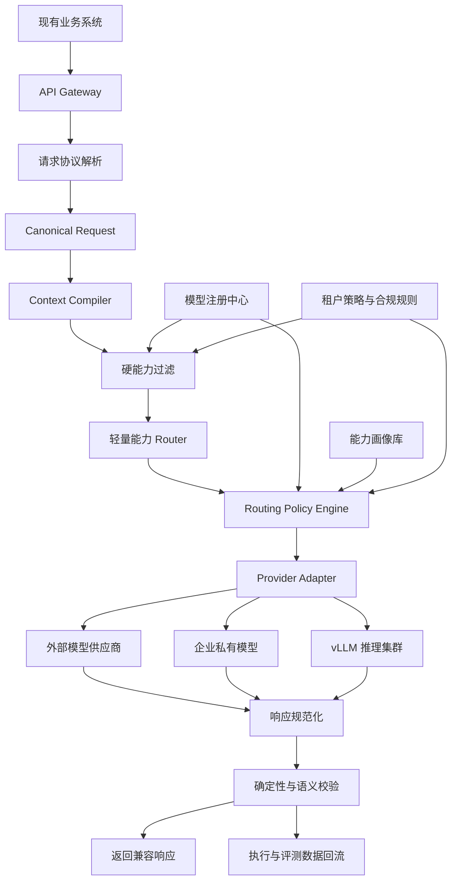
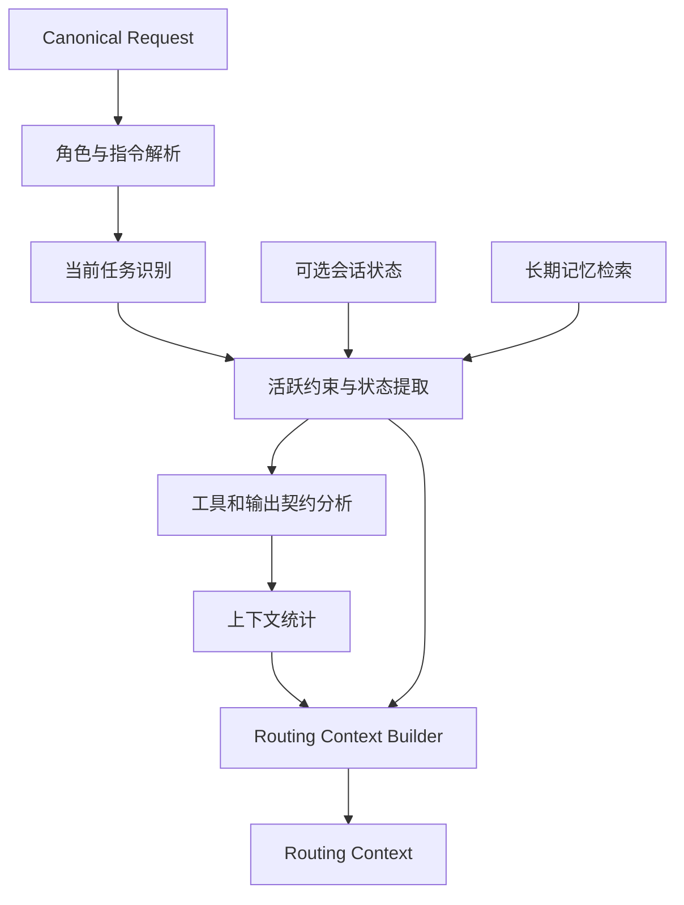
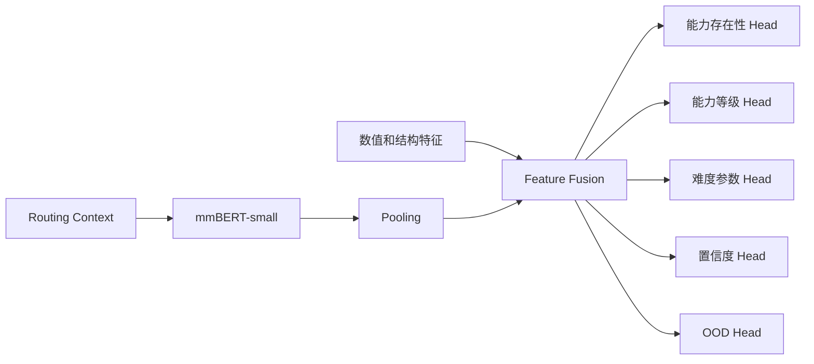
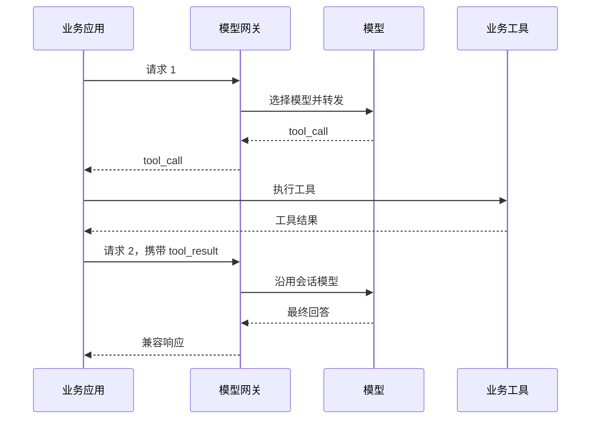
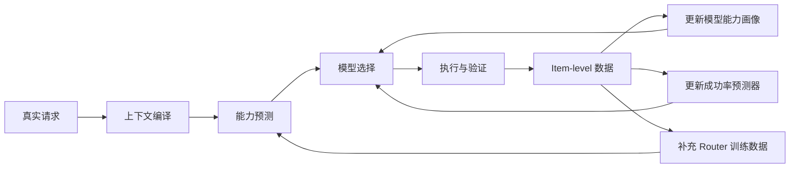

企业内部接入的模型逐渐增多后，模型选择通常会经历三个阶段。
早期由业务代码直接指定模型。应用数量不多时，这种方式简单，也容易排查问题。随着模型供应商、私有化部署和业务场景增加，模型名、参数、限流和容灾逻辑开始散落在各个服务中，维护成本随之上升。
随后会引入统一模型网关，集中处理鉴权、配额、供应商适配和负载均衡。这个阶段解决的是接入问题，尚未解决模型选择问题。请求仍然通过固定模型、静态规则或业务标签分发。
再往后，模型之间的能力、成本和延迟差异开始影响系统运行。固定规则很难持续维护，单纯使用“代码”“数学”“写作”一类高层标签也无法准确描述任务。一个代码请求可能只需要字段提取，一个自然语言排班请求则可能涉及十几条相互耦合的约束。模型路由需要处理的对象，逐渐从业务领域转为任务结构和基础能力需求。
本文给出一套可接入现有系统的设计。应用仍然通过常见的模型接口发送请求，网关内部完成协议规范化、上下文整理、能力需求预测、模型匹配、执行验证和数据回流。方案重点放在技术边界、模型选型、训练数据和在线决策，不讨论项目周期与组织排期。
## 一、系统边界
现有应用不需要理解路由逻辑。调用方式保持为常见的模型请求：
```python
from openai import OpenAI
client = OpenAI(
    api_key="gateway-api-key",
    base_url="https://ai-gateway.company.com/v1",
)
response = client.chat.completions.create(
    model="gpt-4o",
    messages=[
        {
            "role": "system",
            "content": "你是企业知识库助手。"
        },
        {
            "role": "user",
            "content": "根据提供的制度文件判断该申请是否满足审批条件。"
        }
    ],
)
```
这里的 `gpt-4o` 可以是真实模型，也可以是网关中的虚拟模型别名。业务代码保留原模型名称时，租户配置可以将其映射到一组候选模型和一套选择策略。
```yaml
virtual_models:
  gpt-4o:
    routing_policy: balanced
    candidates:
      - provider-a/general
      - provider-b/reasoning
      - internal/private-model
```
这种做法对旧系统影响较小，但要避免把兼容性理解为字段名称相同。不同模型和推理服务对消息角色、工具调用、并行工具、结构化输出、流事件和采样参数的支持并不一致。OpenAI 文档也指出，即使 API 保持向后兼容，固定模型系列中的不同快照仍可能产生行为变化，生产应用应固定模型版本并维护自己的评测集。[1] 
vLLM 提供 Chat Completions、Responses、Embeddings 等兼容端点，但部分字段会被忽略，工具并行能力仍取决于底层模型，聊天请求也依赖正确的 chat template。[2] 
因此，外部协议可以统一，内部能力不能只用一个 `openai_compatible=true` 表示。
## 二、总体架构
系统分为在线数据面和离线控制面。在线数据面处理每次请求，控制面维护模型、评测、能力画像和策略版本。

在线链路中的核心模块包括：
| 模块 | 主要职责 |
|---|---|
| API Gateway | 鉴权、限流、配额、租户识别和请求追踪 |
| Canonical Request Normalizer | 将不同入口协议转换成统一内部结构 |
| Context Compiler | 从当前请求及可用会话状态中构造路由上下文 |
| Capability Gate | 处理模态、上下文窗口、工具、地域等硬限制 |
| Capability Router | 预测任务需要的基础能力和难度 |
| Policy Engine | 结合能力覆盖、质量、成本、延迟和负载选择模型 |
| Provider Adapter | 转换不同供应商的请求与响应格式 |
| Verifier | 检查格式、工具参数、业务规则和回答完整性 |
| Telemetry Pipeline | 保存路由、调用、校验和反馈数据 |
控制面管理的是版本化配置：
```text
模型注册信息
接口功能矩阵
模型能力画像
Router 模型
能力维度定义
策略参数
评测集
提示模板
供应商适配器
```
模型版本、提示词和推理参数需要绑定管理。同一个基础模型在不同 system prompt、量化方式或推理预算下，可能表现出不同的成功率。对路由系统来说，它们应当视为不同的可执行配置。
## 三、内部统一请求协议
网关接收到请求后，先转换成内部的 Canonical Request。后续模块只处理这一结构，避免每个模块分别适配供应商字段。
```json
{
  "request_id": "req_01J...",
  "tenant_id": "tenant-a",
  "application_id": "approval-assistant",
  "protocol": "openai.chat_completions",
  "requested_model": "gpt-4o",
  "messages": [
    {
      "role": "system",
      "content_parts": [
        {
          "type": "text",
          "text": "你是企业审批助手。"
        }
      ]
    },
    {
      "role": "user",
      "content_parts": [
        {
          "type": "text",
          "text": "根据以下制度和申请信息判断是否满足审批条件。"
        }
      ]
    }
  ],
  "tools": [],
  "tool_choice": "auto",
  "output_contract": {
    "type": "json_schema",
    "schema": {}
  },
  "generation": {
    "temperature": 0.2,
    "top_p": 1.0,
    "max_output_tokens": 2000,
    "stream": true
  },
  "session": {
    "conversation_id": null,
    "previous_response_id": null
  },
  "metadata": {}
}
```
内部协议需要保存原请求的全部语义，而不是只保留文本。以下内容不能在规范化过程中丢失：
- 消息角色及顺序；
- system、developer 和 user 指令；
- 图片、文件、音频等输入；
- 工具定义和工具选择策略；
- JSON Schema 或其他输出约束；
- 并行工具调用要求；
- stop sequence；
- 最大输出长度；
- 流式返回方式；
-供应商特有但会影响结果的推理参数。
供应商不支持某项能力时，网关有三个选择：更换模型、进行可验证的近似转换，或返回明确错误。静默丢弃参数通常会造成难以定位的行为差异。
模型功能矩阵应细化到接口能力：
```json
{
  "model_id": "internal/model-a",
  "features": {
    "chat_completions": true,
    "responses": false,
    "streaming": true,
    "vision": false,
    "native_tools": true,
    "parallel_tool_calls": false,
    "json_schema": true,
    "logprobs": false,
    "seed": false
  }
}
```
LiteLLM 可以承担一部分供应商适配、成本记录和基础负载均衡。其代理服务提供统一接口，并支持通过更换 `base_url` 使用 OpenAI SDK。[3] 
能力路由、上下文编译、模型画像和租户策略仍建议保持独立。这些模块依赖企业自己的数据结构，不宜与某个通用代理框架的配置格式耦合。
## 四、Router 前的上下文管理
轻量 Router 不适合直接读取完整会话。实际请求中可能包含几十轮历史、大段工具结果、文件内容和重复 system prompt。把所有内容交给 Router 会增加延迟，也会让 Router 自身的长上下文能力成为系统上限。
更合适的处理方式是生成两套上下文：
```text
Routing Context
用于判断能力需求，允许结构化和压缩
Execution Context
用于模型执行，默认保持原始任务语义
```
两者不能混用。Router 使用摘要，不代表执行模型也应使用同一摘要。
### 4.1 无状态请求与增强会话
系统需要同时处理两种输入。
无状态模式下，调用方在每次请求中携带完整 `messages`。网关只依赖当前请求即可完成基础路由。
增强会话模式下，调用方额外提供稳定的会话标识：
```http
X-Conversation-ID: conv-123
X-User-ID: user-456
```
也可以放在 metadata 中：
```json
{
  "metadata": {
    "conversation_id": "conv-123",
    "user_id": "user-456"
  }
}
```
会话状态可以改善任务连续性、工具链粘性和历史失败利用，但不能成为基础路由的必要条件。否则旧系统在没有传递会话标识时会出现不可预测的行为。
对于 Responses API 一类服务端状态接口，还需要明确网关自身的状态保留策略。OpenAI 当前文档显示，不同端点的应用状态保留方式并不相同，Zero Data Retention 也会改变 `store` 等参数的实际行为。[4] 
### 4.2 分层上下文
上下文管理可以划分为五层。
#### 原始事件日志
原始消息、工具调用、路由结果和模型返回以不可变事件保存。它用于审计、重放和重新构造状态，不直接作为在线 Prompt。
```json
{
  "event_id": "evt-1001",
  "conversation_id": "conv-123",
  "event_type": "user_message",
  "timestamp": "2026-07-23T10:20:30+08:00",
  "content_ref": "object://conversation/evt-1001",
  "sensitivity": "internal"
}
```
#### Working State
Working State 保存当前任务仍然有效的事实、约束、决定和未解决事项。
```json
{
  "task": {
    "goal": "判断申请是否满足审批条件",
    "phase": "policy_validation",
    "status": "active"
  },
  "facts": [],
  "constraints": [
    {
      "id": "c1",
      "text": "金额超过十万元需要二级审批",
      "status": "active",
      "source_event": "evt-872"
    }
  ],
  "decisions": [],
  "unresolved": [
    "申请人的部门信息尚未提供"
  ],
  "execution": {
    "current_model": null,
    "previous_failures": []
  }
}
```
这部分使用结构化对象，避免每次重新生成整段自然语言摘要。
#### 近期窗口
保留最近若干轮原始消息，用于处理局部指代、语气和刚发生的状态变化。
#### 长期记忆
长期记忆包含相对稳定的用户信息、历史任务结果和模型执行经验。写入需要有明确规则，不能把每一条模型推断都当作事实保存。
#### 外部证据
业务文档、数据库结果和工具返回单独管理，并记录来源、时间和权威级别。用户陈述、模型推断和企业权威系统数据不能混在同一事实层中。
MemGPT 将有限上下文视为分层内存管理问题，通过不同存储层之间的信息迁移构造有效上下文。[5]  LongMemEval 的结果则表明，长期记忆效果与索引粒度、检索策略、时间过滤和阅读方式均有关，仅扩大模型上下文窗口不能代替记忆设计。[6] 
### 4.3 Request Context Compiler
Context Compiler 的输入是 Canonical Request、可用 Working State 和少量检索结果。

输出可以控制在一千到四千 token。具体预算取决于 Router 的输入窗口和线上延迟要求。
```json
{
  "current_request": {
    "summary": "根据已有制度和申请信息判断是否允许审批",
    "depends_on_history": true
  },
  "task_state": {
    "goal": "完成审批规则判断",
    "phase": "rule_evaluation",
    "active_constraints": [
      "金额超过十万元需要二级审批",
      "申请人必须属于项目成员"
    ],
    "unresolved_items": [
      "申请人的部门信息尚未提供"
    ]
  },
  "request_features": {
    "input_tokens": 12800,
    "message_count": 18,
    "entity_count": 7,
    "constraint_count": 9,
    "tool_count": 2,
    "schema_depth": 3,
    "dependency_span_tokens": 6200
  },
  "execution_history": {
    "previous_model": "model-a",
    "previous_failure": "missing_constraint"
  }
}
```
### 4.4 压缩规则
上下文压缩适合按信息类型处理。
必须保留原文的内容包括：
- 当前请求；
- system 和 developer 指令；
-数字、标识符和路径；
-工具调用编号；
-JSON Schema；
-明确硬约束；
-需要引用的证据片段。
适合转成结构化状态的内容包括：
-任务目标；
-实体及属性；
-约束；
-已确认事实；
-已作出的决定；
-状态变化；
-未解决事项。
适合摘要的内容包括：
-已结束的讨论分支；
-重复解释；
-不再需要逐字引用的历史。
大型文件和工具输出只保留引用及必要元数据，需要时再检索局部内容。
长上下文模型也不应取消这一层。HELMET 的研究显示，简单的 Needle-in-a-Haystack 测试不能稳定预测实际长上下文任务表现，不同长上下文任务类别之间的相关性较低。[7] 
## 五、基础能力空间
Router 需要预测任务完成所依赖的基础操作。高层领域标签可以保留为辅助特征，但不作为模型能力的主要定义。
可以简单设置十二个一级维度仅供参考。

| 编号 | 能力维度 | 测量对象 |
|---|---|---|
| C01 | 指令识别与层级处理 | 多项要求、角色优先级和冲突指令 |
| C02 | 结构解析与字段抽取 | 列表、表格、JSON、代码块和嵌套结构 |
| C03 | 相关信息筛选 | 噪声排除和有效证据定位 |
| C04 | 实体与符号绑定 | 人、对象、变量、代词、编号和关系 |
| C05 | 状态维护与更新 | 多实体状态、事件顺序和属性覆盖 |
| C06 | 长程检索与跨片段聚合 | 长文本定位、多段连接和远距离依赖 |
| C07 | 规则应用与关系推导 | 条件、否定、量词和关系传递 |
| C08 | 多步组合与约束求解 | 多步骤、分支、搜索、规划和约束满足 |
| C09 | 数值与符号精确操作 | 计算、计数、排序和符号变换 |
| C10 | 输出格式与精确生成 | JSON Schema、DSL、字段和长度要求 |
| C11 | 工具选择与调用编排 | 工具选择、参数构造和多轮工具状态 |
| C12 | 验证、修正与不确定性处理 | 错误检测、局部修复、追问和弃答 |
知识库问答占比较高时，可以增加上下文忠实性与证据归因。该能力关注结论是否由提供的资料支持，以及引用是否覆盖实际声明。
能力维度不应和难度参数混在一起。Router 还要估计：
```json
{
  "entity_count": 12,
  "state_update_count": 8,
  "constraint_count": 17,
  "operation_depth": 6,
  "branching_factor": 3,
  "dependency_distance_tokens": 9000,
  "irrelevant_context_ratio": 0.42,
  "schema_depth": 4,
  "tool_count": 7,
  "expected_tool_rounds": 3
}
```
两个任务都可能需要状态维护，但实体数量和更新次数不同，对模型的要求也不同。
## 六、模型能力画像
模型能力画像包含两部分：接口能力和任务能力。
接口能力是确定性的，包括上下文窗口、模态、工具调用、数据地域和输出格式支持。任务能力来自评测数据。
```json
{
  "model_id": "internal/general-v3",
  "profile_version": "2026-07-01",
  "language": "zh-CN",
  "interface": "native_tool_calling",
  "capabilities": {
    "state_tracking": {
      "base_score": 0.82,
      "entity_curve": {
        "4": 0.96,
        "8": 0.86,
        "16": 0.57
      },
      "update_curve": {
        "2": 0.94,
        "5": 0.81,
        "10": 0.49
      }
    },
    "structured_output": {
      "base_score": 0.95,
      "schema_depth_curve": {
        "1": 0.99,
        "3": 0.94,
        "5": 0.78
      }
    }
  }
}
```
单一平均分不适合在线路由。模型在低难度任务上可能表现接近，高难度区域才出现差异。更有用的记录包括：
-基础准确率；
-保持某一成功率时的能力阈值；
-难度上升后的退化斜率；
-多次采样方差；
-评测样本量；
-置信区间；
-最近评测时间。
能力画像必须绑定实际运行配置。同一模型的原生 function calling 和通过 Prompt 模拟的 function calling 应分开评估。
## 七、能力评测数据
每个能力维度建议同时使用公开基准、参数化生成数据和企业私有数据。
公开基准用于保持基本可比性，参数化数据用于测量退化曲线，私有数据用于校准真实业务分布。
### 7.1 指令与格式能力
IFEval 使用可程序验证的指令，例如字数限制、关键词出现次数和格式要求。它适合测量多约束指令遵循，评测结果也比单纯依赖模型裁判更容易复现。[8] 
结构化输出可使用 StructEval 一类数据，覆盖 JSON、YAML、CSV、HTML、React 和 SVG 等格式，并区分生成和格式转换任务。[9] 
企业内部还应生成自己的 Schema 测试集，控制：
```text
字段数量
嵌套深度
可选字段比例
枚举数量
跨字段依赖
错误输入
长字符串和特殊字符
```
### 7.2 规则与逻辑能力
LogicBench 覆盖命题逻辑、一阶逻辑和非单调逻辑中的二十五种推理模式，可用于分离否定、条件推理和关系传递等基础操作。[10] 
企业规则通常与公开逻辑题不同，还需要从制度、审批、权限和业务状态机中构造可执行规则测试。答案最好由规则引擎生成，减少人工裁判误差。
### 7.3 工具调用
BFCL 覆盖单次、串行、并行和多轮函数调用，并使用抽象语法树或状态变化验证调用结果。它也包含模型应当拒绝调用工具的场景。[11] 
内部工具评测应使用沙箱环境，检查最终状态，而不只比较工具调用文本。以下两个调用序列可能不同，但最终系统状态相同；逐 token 比较会把有效方案误判为错误。
### 7.4 长上下文和记忆
长上下文能力需要分别测试：
-目标信息检索；
-多片段聚合；
-跨段规则推理；
-时间顺序；
-状态更新；
-无答案时弃答；
-干扰内容鲁棒性。
只测某个事实能否从一百二十八千 token 中找到，无法代表模型是否能在同样长度下完成复杂约束或多文档聚合。
### 7.5 参数化生成器
公开基准通常只有有限难度分布。企业评测平台应提供可控生成器。
```text
实体数量：2、4、8、16
状态更新次数：1、3、5、10
约束数量：2、5、10、20
推理深度：1、3、5、8
干扰比例：0%、20%、50%、80%
Schema 深度：1、2、4、6
工具数量：1、5、20、50
```
每个模型最终得到的是一组条件能力曲线。
## 八、轻量 Router 的模型选型
Router 执行的是固定维度多标签分类、等级回归和置信度估计。对这种任务，Encoder 架构通常比自回归生成模型更直接。
ModernBERT 的研究将 Encoder-only 模型定位于分类和检索任务，并提供原生 8192 token 序列长度。[12] 
### 8.1 mmBERT-small
mmBERT-small 可以作为默认候选。其模型卡显示，该模型采用 ModernBERT 架构，覆盖多语言数据并使用 MIT 许可证。[13] 
适用条件：
-中英文混合请求较多；
-Routing Context 不超过 8K；
-能力空间固定；
-需要多任务分类和回归；
-希望进行全参数微调。
建议在 pooled representation 后添加多个任务头：

### 8.2 bge-small-zh-v1.5
bge-small-zh-v1.5 的模型卡标注为中文 BERT 类特征模型，约二千四百万参数，采用 MIT 许可证。[14] 
它适合作为低成本基线：
-请求以中文为主；
-Routing Context 已压缩到较短长度；
-部署资源有限；
-希望在中央处理器或较低规格推理服务上运行。
其上下文长度较短，不适合直接读取完整会话。使用它时，Context Compiler 的质量会比扩大模型参数更重要。
### 8.3 Qwen3-Embedding-0.6B
Qwen3-Embedding-0.6B 适合长上下文和混合语义场景。官方模型卡将其定位为 embedding 模型，并提供 Sentence Transformers 使用方式。[15] 
它可以承担三种角色：
-长上下文二级 Router；
-mmBERT 低置信度请求的升级模型；
-为轻量 Router 生成语义表示或蒸馏标签。
所有请求都使用零点六十亿参数模型会增加在线成本。是否采用二级 Router，需要通过真实流量测试低置信度比例和错误降级成本。
### 8.4 Gemma 3 270M
Gemma 3 270M 适合任务定义较明确、需要少量文本生成或动态结构输出的路由场景。Google 将其描述为面向专项微调的小模型，强调指令遵循和文本结构能力。[16] 
固定十二维分类任务中，Encoder 仍然更容易控制输出。如果能力定义经常变化，或者 Router 需要生成解释和动态 JSON，生成式小模型才更有使用价值。
### 8.5 推荐结构
实际部署可以采用两级方案：
```text
规则提取和硬能力过滤
          ↓
mmBERT-small
          ↓
低置信度或 OOD 请求
          ↓
Qwen3-Embedding-0.6B 或较强 Router
```
bge-small-zh-v1.5 保留为低成本对照。只有在相同训练数据上完成比较，才能判断额外参数是否带来实际路由收益。
## 九、Router 训练数据
Router 的训练目标是预测能力需求，标签不能只来自人工主观判断。
较稳妥的数据结构由四部分组成。
### 9.1 公开评测映射
将公开 benchmark item 映射到能力标签和难度参数。
```json
{
  "item_id": "logicbench-001",
  "capability_labels": {
    "rule_application": 1,
    "entity_binding": 1,
    "state_tracking": 0,
    "structured_output": 0
  },
  "difficulty": {
    "operation_depth": 3,
    "entity_count": 4
  }
}
```
这部分数据适合构造能力边界，但与企业请求的语言和格式会有差异。
### 9.2 参数化合成数据
通过程序生成成组样本，逐项改变难度变量。每一组样本保持语义和领域接近，只改变实体数、约束数或依赖距离。
这种数据可用于训练 Router 识别任务结构，也能用于测量执行模型的能力曲线。
### 9.3 企业请求
企业请求经过脱敏、去重和模板聚类后进入训练集。需要保存原始请求结构，包括 system prompt、历史消息、工具定义和输出契约。只抽取最后一条 user message 会丢失大量路由信号。
### 9.4 多模型执行结果
同一请求在候选模型上执行，记录：
```text
是否完成任务
违反了哪些约束
格式是否有效
工具是否调用正确
是否引用了有效证据
耗时
输入输出 token
调用成本
```
RouteLLM 使用偏好数据训练强弱模型之间的路由器，说明真实模型相对表现可以形成路由监督信号。[17] 
本文方案比二模型偏好路由多了一层能力表示。多模型结果可以用于校准：
```text
某项能力是否真的必要
任务需要多高的能力水平
能力组合如何影响最终成功率
```
## 十、标签生成与校准
标签可以由规则、Teacher 模型和执行结果共同产生。
### 10.1 规则标签
可以确定性计算的字段不应交给模型标注：
```text
输入 token 数
消息数量
工具数量
Schema 深度
是否包含图片
是否要求并行工具
明确约束数量
实体数量
```
### 10.2 Teacher 标签
Teacher 用于识别隐式能力需求，例如：
-是否存在隐藏约束；
-是否需要回溯；
-当前请求是否依赖较早历史；
-是否需要先追问；
-哪些能力属于任务瓶颈。
Teacher 输出需要结构化，并保留置信度和理由代码，避免把自然语言分析直接作为训练标签。
### 10.3 执行结果校准
如果 Teacher 认为任务不需要状态追踪，但所有状态追踪较弱的模型都失败，而状态追踪较强的模型稳定成功，这组结果应反馈到标签修正。
一种可行的建模方式是联合学习任务需求和模型成功率：
$$
P(y_{m,x}=1)
=
\sigma
\left(
b_m+b_x+
\sum_d w_{x,d}\left(c_{m,d}-r_{x,d}\right)
\right)
$$
其中：
- $y_{m,x}$ 表示模型 $m$ 是否完成任务 $x$；
- $c_{m,d}$ 是模型在能力维度 $d$ 上的水平；
- $r_{x,d}$ 是任务在该维度上的最低要求；
- $w_{x,d}$ 是该能力对当前任务的重要性。
这里不要求线上直接运行该公式。它可以作为离线校准模型，检查人工能力定义是否能够解释真实模型差异。
## 十一、防止 Router 退化为领域分类器
训练数据中如果“代码请求通常走强模型”，Router 很容易学习代码块、语言名称和文件扩展名等表面特征。
需要设计反事实样本：
```text
包含代码，但任务只是复制一个字段
不包含代码，但需要十几步状态更新
包含数学公式，但只要求格式转换
语言很简单，但包含二十条耦合约束
同一个逻辑任务分别改写成合同、排班和库存场景
```
测试集也要包含：
-同领域、不同能力任务；
-不同领域、相同能力任务；
-去除领域关键词的任务；
-替换业务实体后的任务；
-训练中没有出现过的能力组合。
随机切分无法检测这种问题。同一模板生成的样本不能同时出现在训练集和测试集。
## 十二、Router 网络与损失函数
Router 输入包含两类特征。
文本特征来自 Routing Context，数值特征来自 Context Compiler。
```text
文本特征：
当前请求摘要
任务状态
活跃约束
近期变化
输出契约摘要
数值特征：
token 数
消息数
实体数
约束数
工具数
Schema 深度
依赖距离
历史失败类型
```
输出包括：
```json
{
  "abilities": {
    "state_tracking": {
      "probability": 0.92,
      "importance": 0.88,
      "minimum_level": 0.77
    },
    "constraint_solving": {
      "probability": 0.96,
      "importance": 0.95,
      "minimum_level": 0.84
    }
  },
  "difficulty": {
    "entity_count": 10,
    "constraint_count": 13,
    "operation_depth": 5
  },
  "router_confidence": 0.83,
  "ood_score": 0.09
}
```
能力是否存在、重要性和最低水平是三个不同目标。
- `probability` 表示是否需要该能力；
- `importance` 表示该能力失败后对任务的影响；
- `minimum_level` 表示任务难度形成的最低能力门槛。
损失函数可以写成：
$$
\mathcal{L}
=
\alpha \mathcal{L}_{presence}
+
\beta \mathcal{L}_{level}
+
\gamma \mathcal{L}_{difficulty}
+
\delta \mathcal{L}_{success}
+
\eta \mathcal{L}_{calibration}
+
\zeta \mathcal{L}_{ood}
$$
能力等级适合使用有序回归：
```text
0  不需要
1  低要求
2  中等要求
3  高要求
4  核心瓶颈
```
训练完成后还需要单独做概率校准。分类准确率较高但置信度失真，会直接影响升级阈值和风险控制。
## 十三、策略引擎
Router 不直接选择模型。策略引擎接收能力需求、模型画像和实时运行数据，再完成最终决策。
### 13.1 硬约束过滤
先剔除无法表达请求语义的模型：
```python
def hard_filter(request, models):
    candidates = []
    for model in models:
        if not model.supports_modalities(request.modalities):
            continue
        if model.context_window < request.required_context_window:
            continue
        if request.requires_tools and not model.supports_tools:
            continue
        if request.requires_parallel_tools and not model.supports_parallel_tools:
            continue
        if not model.supports_output_contract(request.output_contract):
            continue
        if request.region not in model.allowed_regions:
            continue
        if request.data_classification not in model.allowed_data_classes:
            continue
        candidates.append(model)
    return candidates
```
硬约束还包括租户模型白名单、供应商健康状态、数据地域和保留策略。
### 13.2 能力缺口
对任务 $x$ 和模型 $m$，可以定义：
$$
G(m,x)
=
\sum_d
w_{x,d}
\max\left(0,r_{x,d}-c_{m,d,z}\right)
$$
其中：
- $r_{x,d}$ 是任务最低要求；
- $w_{x,d}$ 是能力重要性；
- $c_{m,d,z}$ 是模型在当前难度参数下的能力。
关键能力可以设置不可补偿门槛。例如约束求解缺口超过零点一时，其他能力再高也不进入候选列表。
### 13.3 成功率预测
模型成功率预测器可以使用逻辑回归、梯度提升树或小型多层感知机。
输入包括：
```text
任务能力需求
任务难度
模型能力画像
接口转换方式
历史相似请求表现
当前负载
历史错误类型
```
输出为：
$$
P(\text{success}\mid x,m)
$$
第一版没有必要直接采用强化学习。离线监督学习更容易解释和回放。
### 13.4 质量门槛下的成本选择
在线优化目标可以写成约束问题：
$$
\min_m \operatorname{Cost}(m,x)
$$
满足：
$$
P(\text{success}\mid m,x) \ge q_{\min}
$$
同时满足延迟、合规和接口约束。
当多个模型都满足质量门槛时，再比较成本和预测延迟。高风险业务可以提高 $q_{\min}$，并强制使用验证器。
返回结果应包含候选顺序：
```json
{
  "primary": "provider/model-b",
  "fallbacks": [
    "internal/model-c",
    "provider/model-d"
  ],
  "predicted_success": 0.91,
  "predicted_cost": 0.018,
  "predicted_p95_latency_ms": 2200,
  "reason_codes": [
    "HIGH_CONSTRAINT_COUNT",
    "STRICT_STRUCTURED_OUTPUT",
    "MODEL_B_LOWEST_ACCEPTABLE_COST"
  ]
}
```
Reason code 用于审计，不需要生成长篇自然语言解释。
## 十四、执行上下文
选定模型后，系统构建 Execution Context。
默认行为是保留原始请求。如果模型窗口不足或业务明确开启上下文优化，才执行压缩。
压缩顺序可以设置为：
```text
移除已确认无关的历史
压缩大型工具输出
将结束的历史分支转成结构化状态
检索必要原文片段
保留当前请求和关键指令
```
不同模型可使用不同的 Prompt Adapter。
小模型需要更明确的结构和更少的噪声：
```text
任务目标
输入事实
约束列表
操作要求
输出 Schema
```
长上下文模型可以保留更多证据原文，但仍应避免无条件附加完整日志。
工具模型需要完整的工具描述、调用状态和未完成操作。
这些差异属于执行适配，不应改变用户原始意图。
## 十五、工具调用和会话粘性
工具调用轨迹通常跨多个 API 请求。模型在第一轮生成工具调用，业务执行后，再把工具结果发送回来。

请求中存在未完成工具调用时，默认沿用前一模型。随意切换会引入 Tool Call ID、消息格式和状态理解差异。
以下情况可以迁移：
-原模型不可用；
-原模型持续返回非法调用；
-后续请求出现原模型不支持的能力；
-业务策略允许重建上下文；
-迁移适配器能够验证工具状态完整性。
没有会话标识时，可以根据工具调用编号和短时间请求指纹推断轨迹，但可靠性有限。现有系统最好通过 Header 或 metadata 传递 conversation ID。
## 十六、流式输出、重试与回退
流式请求的模型切换边界很明确。
在首个输出事件发送给客户端之前，网关可以切换备用模型。已经输出部分内容后再替换模型，会破坏文本连续性、JSON 结构和工具调用状态。
```text
首 token 前失败
可以切换 fallback
首 token 后失败
终止当前流并返回错误
```
重试分为两类。
传输级重试处理：
-连接失败；
-限流；
-服务端错误；
-短暂超时；
-节点故障。
语义级重试处理：
-JSON Schema 不通过；
-工具参数非法；
-违反业务约束；
-遗漏必要引用；
-验证器判定结果无效。
语义重试需要产生新的 execution attempt，并记录是否更换模型、修改提示或降低采样随机性。
## 十七、验证器
验证器应优先使用确定性方法。
### 确定性验证
适合：
-JSON Schema；
-SQL、XML 和 DSL 解析；
-工具参数类型；
-数值范围；
-业务规则；
-引用是否存在；
-最终环境状态。
### 轻量语义验证
适合：
-要求是否遗漏；
-结论是否与输入矛盾；
-是否回答了当前问题；
-信息不足时是否应追问。
### 强模型验证
用于合同、金融操作、外部发布和高成本自动执行。它不应成为所有请求的固定链路，否则调用成本和延迟会接近双模型执行。
验证结果保持结构化：
```json
{
  "valid": false,
  "failure_types": [
    "CONSTRAINT_VIOLATION",
    "MISSING_REQUIRED_FIELD"
  ],
  "retry_action": "UPGRADE_MODEL"
}
```
---
## 十八、数据闭环
每次请求至少产生以下记录：
```text
请求特征
Routing Context 版本
Router 输出
候选模型
最终模型
策略版本
执行参数
响应状态
验证结果
成本
延迟
用户反馈
```
日志示例：
```json
{
  "request_id": "req-456",
  "route_id": "route-789",
  "router_version": "router-12",
  "policy_version": "balanced-7",
  "selected_model": "provider/model-b",
  "fallback_count": 0,
  "input_tokens": 12500,
  "output_tokens": 820,
  "latency_ms": 1832,
  "status": "success",
  "verification": {
    "schema_valid": true,
    "business_rules_valid": true
  }
}
```
数据闭环可用于三类更新：
1. 更新模型能力画像；
2. 更新成功率预测器；
3. 生成 Router 的增量训练数据。
不能直接把用户接受回答视为任务成功。很多接口没有显式反馈，用户也可能接受错误结果。优先使用可执行验证和业务结果。
---
## 十九、评测指标
Router 的离线分类指标只反映一个环节。
### Router 指标
```text
能力多标签 Macro-F1
每项能力 AUPRC
能力等级误差
难度参数误差
置信度 ECE
Brier Score
OOD AUROC
```
### 路由指标
```text
Top-1 合适模型命中率
Top-2 合适模型召回率
错误降级率
错误升级率
fallback 率
首次执行成功率
routing regret
```
Routing regret 定义为：
$$
\operatorname{Regret}(x)
=
U(m_{\text{oracle}},x)
-
U(m_{\text{selected}},x)
$$
其中 Oracle 是离线评测中效用最高的模型。
### 端到端指标
```text
任务成功率
每个成功任务的平均成本
P50、P95 和 P99 延迟
首 token 延迟
结构化输出失败率
工具调用完成率
用户重试率
人工介入率
```
错误降级通常比错误升级更需要关注。前者会直接损害任务结果，后者主要增加成本和延迟。
## 二十、存储与服务组件
数据层可以采用常见的企业基础设施。

| 组件 | 用途 |
|---|---|
| PostgreSQL | 模型注册、策略、Working State 和路由元数据 |
| Redis | 会话粘性、热能力画像、限流和熔断状态 |
| Kafka 或 Pulsar | 请求事件、执行结果和异步评测任务 |
| 对象存储 | 原始日志、大型工具输出和训练数据 |
| pgvector 或检索服务 | 长期记忆和相似任务检索 |
| ClickHouse | 大规模路由和调用分析 |
| OpenTelemetry | 全链路追踪 |
| Prometheus 和 Grafana | 服务指标与告警 |
在线服务可以拆为：
```text
gateway-api
request-normalizer
context-compiler
capability-router
routing-policy-service
provider-adapter
verifier-service
model-registry
evaluation-service
```
服务是否物理拆分取决于流量和维护边界。逻辑边界建议保留，避免把上下文、选模和供应商请求写进一个难以测试的处理函数。
## 二十一、安全与合规
模型网关能够看到完整请求、工具定义和模型返回，因此需要明确数据边界。
模型注册信息中应保存：
```json
{
  "allowed_data_classes": [
    "public",
    "internal"
  ],
  "allowed_regions": [
    "cn-east"
  ],
  "external_provider": false,
  "retention_policy": "zero-retention"
}
```
路由顺序应满足：
```text
租户权限和数据合规
接口功能兼容
任务质量门槛
延迟和成本
```
至少需要控制：
- 租户和应用隔离；
- 模型与供应商白名单；
- 数据地域；
- 敏感字段识别；
- 请求和日志脱敏；
- 密钥托管；
- 配额和预算；
- 状态保留期限；
- 用户删除；
- 路由结果审计。
向量检索必须在租户命名空间内执行。长期记忆也不能默认保存所有对话，尤其不能将模型推断自动升级为用户事实。
## 二十二、一次完整请求的处理过程
假设已有系统发送：
```json
{
  "model": "gpt-4o",
  "messages": [
    {
      "role": "system",
      "content": "结果必须符合给定的 JSON Schema。"
    },
    {
      "role": "user",
      "content": "根据十四条员工限制生成排班表。"
    }
  ],
  "response_format": {
    "type": "json_schema",
    "json_schema": {
      "name": "schedule",
      "strict": true,
      "schema": {}
    }
  },
  "stream": true
}
```
网关将 `gpt-4o` 解析为租户的虚拟模型策略。
Context Compiler 提取：
```json
{
  "goal": "生成员工排班",
  "input_tokens": 7200,
  "entity_count": 9,
  "constraint_count": 14,
  "schema_depth": 4,
  "requires_structured_output": true
}
```
Router 输出：
```json
{
  "abilities": {
    "constraint_solving": {
      "importance": 0.96,
      "minimum_level": 0.84
    },
    "state_tracking": {
      "importance": 0.74,
      "minimum_level": 0.67
    },
    "structured_output": {
      "importance": 0.97,
      "minimum_level": 0.90
    }
  },
  "router_confidence": 0.88
}
```
策略引擎评估三种候选：
```text
model-a
成本较低，约束求解能力存在缺口
model-b
满足能力门槛，成本和延迟处于中间水平
model-c
能力覆盖更高，调用成本较高
```
最终选择 model-b，model-c 作为 fallback。
model-b 返回结果后，系统执行 JSON Schema 和排班约束检查。校验通过后，网关将供应商响应转换为原接口要求的流式事件。
业务系统仍然按原有方式消费响应，不需要了解实际模型。
## 二十三、推荐的技术组合
一套相对清晰的实现组合如下。
```text
入口层
Envoy、Nginx 或现有 API Gateway
在线核心服务
Go、Rust 或 Java
Router
mmBERT-small
bge-small-zh-v1.5 作为基线
Qwen3-Embedding-0.6B 作为二级模型
Router 推理
ONNX Runtime、TensorRT 或 Triton
外部模型适配
自研 Adapter 或 LiteLLM
私有模型服务
vLLM
状态与数据
PostgreSQL、Redis、Kafka、对象存储和 ClickHouse
观测
OpenTelemetry、Prometheus 和 Grafana
```
vLLM 当前提供多种兼容端点，也提供分类、评分、Pooling 和健康检查接口，适合作为企业内部开源模型的服务层。[2] 
具体组件不能仅根据功能列表决定。还需要在现有基础设施中验证流式连接、工具协议、并发模型、故障恢复和监控接入。
## 二十四、仍需通过内部数据确认的问题
这套设计可以给出清晰的系统边界，但以下参数没有通用答案：
-十二个能力维度是否足以区分企业现有模型；
-Routing Context 的合理长度；
-mmBERT-small 是否明显优于更小的中文 Encoder；
-二级 Router 能覆盖多少低置信度请求；
-模型能力曲线多久需要重新评测；
-哪些业务需要语义验证器；
-服务端记忆在真实会话中的收益；
-错误降级和错误升级的实际成本；
-能力需求向量能否稳定迁移到新模型。
这些问题需要使用企业自己的请求分布、多模型执行结果和可验证任务来回答。公开 benchmark 能提供能力边界和测试方法，不能直接替代生产流量评估。
系统上线后的核心数据链路应保持为：

最终需要维护的不是一份固定的模型排行榜，而是三个持续更新的对象：
```text
任务需要什么能力
模型在什么条件下能够完成任务
当前业务允许用什么成本和风险完成任务
```
只要这三个对象保持独立，新增模型时可以通过注册、评测和灰度数据进入候选池，业务系统无需修改调用逻辑。模型版本变化后，也可以重新生成能力画像，而不必重写所有路由规则。
## 参考资料
[1] OpenAI API Reference，Backward compatibility。
[2] vLLM Documentation，Online Serving and OpenAI-Compatible Server。
[3] LiteLLM Documentation，Proxy Server and OpenAI-Compatible Access。
[4] OpenAI API Documentation，Data Controls and Application State Retention。
[5] Packer et al.，MemGPT: Towards LLMs as Operating Systems。
[6] Wu et al.，LongMemEval: Benchmarking Chat Assistants on Long-Term Interactive Memory。
[7] Yen et al.，HELMET: How to Evaluate Long-Context Language Models Effectively and Thoroughly。
[8] Zhou et al.，Instruction-Following Evaluation for Large Language Models。
[9] Yang et al.，StructEval: Benchmarking LLMs' Capabilities to Generate Structural Outputs。
[10] Parmar et al.，LogicBench: Towards Systematic Evaluation of Logical Reasoning Ability of Large Language Models。
[11] Patil et al.，The Berkeley Function Calling Leaderboard: From Tool Use to Agentic Evaluation of Large Language Models。
[12] Warner et al.，Smarter, Better, Faster, Longer: A Modern Bidirectional Encoder for Fast, Memory Efficient, and Long Context Finetuning and Inference。
[13] JHU CLSP，mmBERT-small Model Card。
[14] BAAI，bge-small-zh-v1.5 Model Card。
[15] Qwen，Qwen3-Embedding-0.6B Model Card。
[16] Google Developers Blog，Introducing Gemma 3 270M。
[17] Ong et al.，RouteLLM: Learning to Route LLMs with Preference Data。
