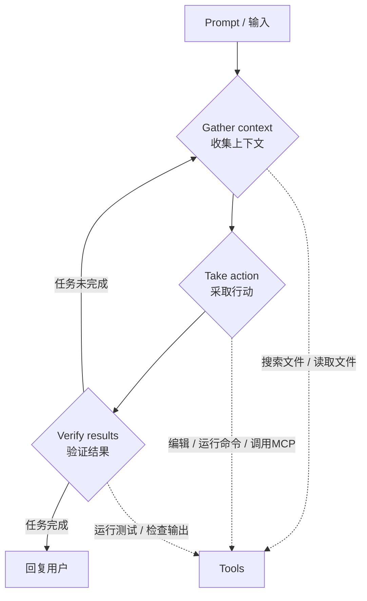
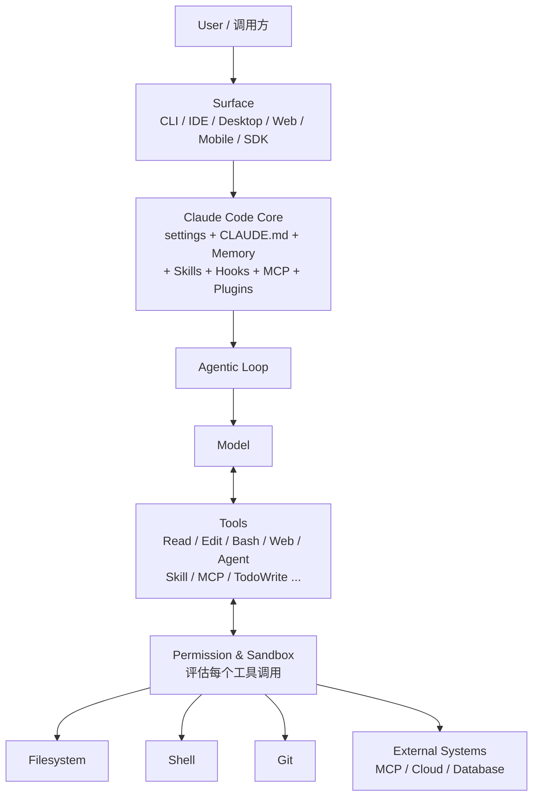

> 来源：Claude Code Cookbook · Part 0 · 原文标题：Part 0 — Claude Code Mental Model

> 本章面向所有读者。它解释 Claude Code 是什么、它的核心执行机制（Agentic Loop）、它能接触哪些资源，以及整本 Cookbook 的组织方式。
> 官方参考：[How Claude Code works](https://code.claude.com/docs/en/how-claude-code-works)、[Overview](https://code.claude.com/docs/en/overview)、[Tools reference](https://code.claude.com/docs/en/tools-reference)、[Context window](https://code.claude.com/docs/en/context-window)

---

## 0.1 Claude Code 是什么

Claude Code 是一个 **Agentic Coding Tool**。它可以读取你的代码、编辑文件、运行命令、搜索内容、调用外部工具（通过 MCP），并自主决定下一步做什么。它运行在终端、IDE、桌面应用、浏览器（Claude Code on the web）以及移动端。

Claude Code 由两个核心组件驱动：

- **Model（模型）**：负责理解和推理。Claude Code 使用 Claude 模型。Sonnet 适合大多数编码任务，Opus 对复杂架构决策提供更强推理能力。会话中可以用 `/model` 切换，或启动时用 `claude --model <name>`。
- **Tools（工具）**：让模型能够行动。没有工具，模型只能返回文本；有了工具，模型可以读取代码、编辑文件、运行命令、搜索 web、调用外部服务。

Claude Code 的角色可以概括为 **Agentic Harness（Agent 载体）**：它围绕模型提供工具、上下文管理和执行环境，把一个语言模型转变成一个能实际工作的编码 Agent。

官方文档用一个循环概括 Claude Code 的工作方式——三段式：**gather context（收集上下文）→ take action（采取行动）→ verify results（验证结果）**。这三段会混合进行：Claude 可能先搜索文件理解代码，再编辑做出修改，然后运行测试来验证自己的成果。

---

## 0.2 Agentic Loop（Agent 循环）

Agentic Loop 是理解 Claude Code 的关键概念。它是模型在不间断的人为介入下，反复「决定 → 行动 → 观察 → 再决定」的循环。

每一步 Claude 都会根据上一步学到的新信息决定下一步动作，可以把几十个动作串联起来并沿途修正方向。你也是这个循环的一部分：你可以在任何时刻打断，指引 Claude 改变方向、补充上下文，或要求换一种方法。

以一个实际例子说明循环中的工具调用序列。当你说「修复失败的测试」时，Claude 可能：

1. 运行测试套件看哪里失败。
2. 读取错误输出。
3. 搜索相关的源文件。
4. 阅读这些文件理解代码。
5. 编辑文件修复问题。
6. 再次运行测试验证。

每一次工具调用都给 Claude 新的信息，这个信息又决定下一步。这就是 Agentic Loop 的实际形态。

### 0.2.1 你可以如何介入

- 按 `Esc` 立即停止 Claude：正在运行的工具调用被取消，Claude 等待你的下一条指令。
- 输入一句纠正并回车发送：不必停止当前运行的工具。Claude 会在当前动作执行完后读到这句话，并在决定下一步前调整方向。

---

## 0.3 内置工具分类

Claude Code 的内置工具按「自主能力」分为五个主要类别：

| 类别 | Claude 能做什么 | 官方文档 |
| --- | --- | --- |
| **File operations（文件操作）** | 读取文件、编辑代码、创建新文件、重命名、重组 | tools-reference |
| **Search（搜索）** | 按模式找文件、用正则搜索内容、探索代码库 | tools-reference |
| **Execution（执行）** | 运行 shell 命令、启动服务器、运行测试、使用 git | tools-reference |
| **Web（网络）** | 搜索 web、获取文档、查找错误信息 | tools-reference |
| **Code intelligence（代码智能）** | 编辑后查看类型错误与警告、跳转到定义、查找引用（需要 code intelligence 插件） | discover-plugins |

以上是主要能力。Claude 还有用于派生 Subagent、向你提问、以及其他编排任务的工具。完整清单见官方 Tools Reference。

外部扩展会叠加在内置工具之上：

- **Skills**：让 Claude 复用工作流。
- **MCP**：连接外部服务。
- **Hooks**：自动化工作流。
- **Subagents**：把任务委派给专用的子 Agent。

---

## 0.4 架构总览（Mental Model）

| 组件 | 说明 |
| --- | --- |
| **User / 调用方** | 在 Terminal、IDE、Desktop、Web、Mobile 或 SDK 中发起交互的人或程序。 |
| **Surface** | 渲染层。CLI、VS Code、JetBrains、Desktop、Web、Mobile、SDK 都是不同 Surface。底层 Agentic Loop 一致，变化的是代码在哪里执行、你如何交互。 |
| **Session** | 一次会话的状态，包含 conversation、context、transcript、session id。 |
| **Claude Code Core** | 加载配置、settings、CLAUDE.md、Memory、Rules、Skills、MCP、Plugins、Hooks，组织 Context，驱动 Agentic Loop。 |
| **Model Provider** | Anthropic API、Amazon Bedrock、Claude Platform on AWS、Google Cloud Agent Platform、Microsoft Foundry，或通过 LLM Gateway。 |
| **Agentic Loop** | 每一轮内：决定下一步 → 调用 Tool → 收到输出 → 决定下一步，直到回复。 |
| **Tools** | Read、Edit、Write、Glob、Grep、Bash、PowerShell、WebFetch、WebSearch、TodoWrite、NotebookEdit、Agent、Skill、MCP 工具。 |
| **Permission & Sandbox** | 决定 Tool 调用是被允许、询问还是拒绝；沙箱用于隔离文件系统与网络。 |

---

## 0.5 执行环境

Claude Code 运行在三种执行环境中，区别在于代码在哪里执行：

| 环境 | 代码在哪里执行 | 适用场景 |
| --- | --- | --- |
| **Local（本地）** | 你自己的机器 | 默认。完全访问你的文件、工具和环境。 |
| **Cloud（云端）** | Anthropic 管理的 VM，或你的组织自建的 self-hosted environment | 卸载任务、处理你本地没有的 repo。 |
| **Remote Control（远程控制）** | 你的机器（从浏览器控制） | 用 Web UI，但执行与文件都在本地。 |

---

## 0.6 完整的 Context 分层

这一节在 Part 7 会深入展开，此处先给出概览，帮助建立最初的心智模型。

Claude 的 **context window（上下文窗口）** 容纳：

- Conversation history（对话历史）
- File contents（文件内容）
- Command outputs（命令输出）
- CLAUDE.md
- Auto memory（自动记忆）
- 已加载的 skills
- System instructions（系统指令）

随着工作推进，context 会填满。Claude 会自动 compact（压缩），但对话早期的一些指令可能丢失。**把持久规则放进 CLAUDE.md，不要依赖对话历史**。运行 `/context` 可以看到什么东西占用了空间。

### 0.6.1 按需加载与隔离

- **Skills 按需加载**：会话开始时 Claude 只看到 skill 描述，完整内容只在 skill 被使用时加载。
- **Subagents 拥有独立 context**：Subagent 与主对话完全隔离，它们的工作不会挤占你的主 context；完成时返回一个摘要。这正是 subagent 有助于长会话的原因。
- **MCP 工具定义默认延迟加载**：通过 tool search 按需加载，以免把完整定义塞进 context。

---

## 0.7 安全机制的初步认识

Claude Code 有两个独立的安全机制（Part 10 与 Part 13 深入）：

1. **Checkpoints（检查点）**：在 Claude 编辑文件前，它会先快照当前文件内容。如果出错，按两次 `Esc` 回退到之前的状态，或让 Claude 撤销。Checkpoints 与 git 相互独立，恢复会话后仍然可用。它们只覆盖文件修改；对远程系统的副作用（数据库、API、部署）无法用 checkpoint 覆盖，这也是 Claude 在执行有外部副作用的命令前会询问的原因。
2. **Permissions（权限）**：用 `Shift+Tab` 循环切换 permission mode：
   - **Manual**：Claude 在文件编辑和 shell 命令前询问。
   - **Accept edits**：Claude 编辑文件并运行常见文件系统命令（如 `mkdir`、`mv`）而不询问，其他命令仍询问。
   - **Plan**：Claude 探索并给出计划，不编辑源文件。
   - **Auto**：Claude 用后台安全检查评估所有动作。
   - **dontAsk**：只允许预先批准的工具。
   - **bypassPermissions**：跳过所有检查（仅限隔离容器与 VM）。

---

## 0.8 高效工作的四条原则

官方「How Claude Code works」给出四条配合工作的原则，值得在阅读正文前建立：

1. **这是一场对话**。你不需要完美 prompt。先说出你想要什么，然后逐步修正：「修复登录 bug」→ [Claude 调查尝试] → 「不太对，问题在 session 处理」→ [Claude 调整方法]。
2. **开头具体，省大量修正**。指出具体文件、提及约束、指向示例模式。模糊 prompt 也能工作，但要花更多时间引导。
3. **给 Claude 一个可以验证的标准**。提供测试用例、粘贴期望 UI 的截图、定义你想要的输出。Claude 在自己能检查成果时表现更好。
4. **委派，不要指挥**。像交给一位能干同事那样：给上下文和方向，信任 Claude 处理细节。不必规定它读哪些文件、跑哪些命令。

---

## 0.9 本 Cookbook 的组织

整本 Cookbook 按读者学习路径组织，分成几个 Track：

| Track | 适用读者 | 覆盖 Part |
| --- | --- | --- |
| **Core（核心）** | 🟢 Beginner → 🟡 Practitioner | Part 0 ~ 14 |
| **Extension（扩展）** | 🔴 Advanced | Part 15 ~ 27 |
| **Platform（平台）** | 🟡+ 全平台 | Part 28 ~ 31 |
| **Agent Engineer** | 🔴 Advanced → Agent Engineer | Part 32 ~ 34 |
| **Enterprise（企业）** | 🟣 Platform / Enterprise | Part 35 ~ 43 |
| **参考** | 全部 | Part 44 ~ 50 + 附录 |

读完本章后，建议按顺序进入 Part 1（Installation & First Run），完成第一次安装与首次会话。

---

## Official References

- [How Claude Code works](https://code.claude.com/docs/en/how-claude-code-works)
- [Overview](https://code.claude.com/docs/en/overview)
- [Tools reference](https://code.claude.com/docs/en/tools-reference)
- [Context window](https://code.claude.com/docs/en/context-window)
- [Common workflows](https://code.claude.com/docs/en/common-workflows)
