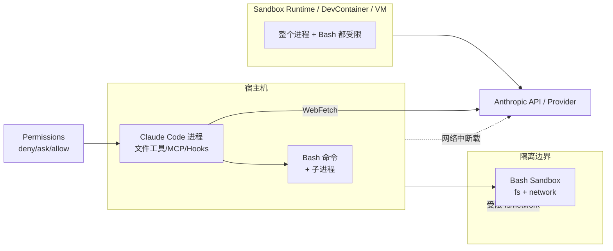

> 来源：Claude Code Cookbook · Part 11 · 原文标题：Part 11 — Sandbox


> 本章是安全核心章节。它解释 Claude Code 的沙箱体系：内置的 sandboxed Bash 工具（filesystem + network 隔离），以及更广的 sandbox runtime、dev container、Docker、VM 等隔离方案。最后建立 Threat Model。
> 官方参考：[Configure the sandboxed Bash tool](https://code.claude.com/docs/en/sandboxing)、[Choose a sandbox environment](https://code.claude.com/docs/en/sandbox-environments)、[Security](https://code.claude.com/docs/en/security)

---

## 11.0 什么是 Sandbox

Sandbox（沙箱）是一个隔离边界，限制 Claude Code 会话能读取、写入、触达的网络。这让 Claude 能在**更少权限提示**下工作、无人值守运行、或处理你不完全信任的代码。

Claude Code 的沙箱核心是 **Bash sandbox（sandboxed Bash tool）**：用操作系统原语限制 Claude 运行的每个 Bash 命令的 filesystem 和 network 访问。它内建于 Claude Code，运行在 macOS、Linux 和 WSL2 上。**原生 Windows 不支持**；在 Windows 上要在 WSL2 分布中运行 Claude Code。

需要先理解一个关键边界：

- **内置工具**（Read、Edit、WebFetch 等）在 Claude Code 进程内运行，不产生任意代码，用权限规则按路径/域门控。
- **MCP servers 和 hooks 是独立进程**，在宿主机上不受约束地运行。
- **Bash sandbox 只约束 Bash 命令及其子进程**。

所以要把内置工具、MCP servers、hooks 都放进同一个 OS 边界，需要用 sandbox runtime、dev container 或 custom container 包住整个 Claude Code 进程，或者用 VM。

---

## 11.1 内置 Bash Sandbox

### 11.1.1 平台

- macOS：用内建 Seatbelt 框架，无需额外安装。
- Linux 和 WSL2：依赖两个包（`bubblewrap` 和 `socat`）。安装后可运行 `/sandbox` 让其面板显示是否缺东西。
- 原生 Windows：不支持。

### 11.1.2 开始使用

在会话中运行 `/sandbox`，打开沙箱面板，含标签页：

- **Mode**：选择 sandboxed 命令如何被批准。
- **Overrides**：选择沙箱下失败的命令是否走回退路径。

面板会显示每个设置和切换状态的实时配置。

### 11.1.3 核心价值：让 Bash 命令免提示运行

Bash sandbox 让 Claude 运行大多数 shell 命令而不必停下来问权限。你定义命令能触碰哪些文件和网络域，操作系统为**每条 Bash 命令及其子进程**强制那个边界。这改变了安全模型：从前是「逐条批准命令」，现在是「定义边界，一切在边界内运行」。

### 11.1.4 Sandbox Modes（批准模式）

`/sandbox` → **Mode** 标签选择批准方式。常见模式概念（详见官方文档）：

- **auto-allow**：沙箱内的命令自动放行，无需逐条提示（前提是配置了受信任的权限集）。
- **override / block**：沙箱下失败的命令可配置为回退或阻止。

> 具体模式名以官方 `sandboxing.md` 为准。启用沙箱且 `autoAllowBashIfSandboxed` 为默认 `true` 时，沙箱 Bash 命令免提示运行，沙箱边界替代整个工具的提示。这在 plan mode 中有例外（见官方文档）。

### 11.1.5 默认边界与配置

默认/filesystem 与 network 边界可通过 settings 的 `sandbox` 键配置。fs 边界合并 `sandbox.filesystem` 设置与 Read/Edit deny 规则；网络边界合并 WebFetch 权限规则与 `allowedDomains`/`deniedDomains` 列表。详见官方 [Sandboxing](https://code.claude.com/docs/en/sandboxing) 与 [Settings 的 sandbox 部分](https://code.claude.com/docs/en/settings#sandbox-settings)。

### 11.1.6 与权限/模式如何交互

- **Permissions** 决定工具调用是否运行、是否先提示。
- **Isolation** 限制命令运行后能访问什么。
- 两者协作：权限模式让动作免提示运行时，隔离边界限制这些动作能触达的范围。

**关键安全警告**：用 `--dangerously-skip-permissions` 时，Claude 不问你就行动。Claude Code 只对少量场景仍提示（显式 ask 规则、组织 ask connector、`requiresUserInteraction` MCP、针对 `/` 或 home 的删除、cross-session messaging safeguards）。**没有提示来兜底错误，选用的隔离边界就是保护系统的唯一手段**。官方明确建议：`--dangerously-skip-permissions` 会话**始终**在容器、VM 或 sandbox runtime 内运行，让文件工具、MCP servers、hooks 也都在边界内。Linux/macOS 上 Claude Code 拒绝在 root 下用此 flag 启动。

[Auto mode](https://code.claude.com/docs/en/permission-modes#eliminate-prompts-with-auto-mode) 用分类器替代提示来 review 动作。分类器是**逐动作**的控制，不是隔离边界，所以无人值守运行时隔离边界仍增加 defense-in-depth（不如 `--dangerously-skip-permissions` 那样强制要求）。

**Bash sandbox 单独不足以支持完全无人值守运行**——它只约束 Bash。可叠加：在容器/VM 内运行 sandboxed Bash tool，得到外层环境边界之上的 OS 级命令限制。

---

## 11.2 广的比较：各隔离方案

下表全部来自官方 [Sandbox environments](https://code.claude.com/docs/en/sandbox-environments)。区别在于**隔离什么**和**需要什么**。

| 方案 | 隔离了什么 | 需要 Docker? | 设置工作量 |
| --- | --- | --- | --- |
| Sandboxed Bash tool | Bash 命令及其子进程 | 否 | macOS 最小；Linux/WSL2 低 |
| Sandbox runtime | 整个 Claude Code 进程（含文件工具、MCP、hooks） | 否 | 低 |
| Dev container | 完整开发环境 | 是 | 中 |
| Custom container | 完整开发环境 | 是 | 中到高 |
| Virtual machine | 完整操作系统 | 否 | 高 |
| Claude Code on the web | 完整 OS（Anthropic 托管） | 否 | 无（需订阅） |

前两种在宿主 OS 上运行、不需要容器。其余把 Claude Code 放进容器或 VM。**前两种之外的方案把整个 Claude Code 进程放进隔离边界**，所以文件工具、MCP servers、hooks 也受限制。

⚠️ 官方警告：**沙箱隔离降低突破的影响，但消除不了风险**。允许网络出口的方案仍可能泄露 Agent 能读到的数据；把项目目录以可写方式挂载的方案仍可修改那些代码。隔离也不改变**发给模型的内容**——你的 prompt 和 Claude 读的文件无论有无沙箱都会发送给 Anthropic API 或你配置的 provider。

### 11.2.1 如何选择

| 你想 | 从哪个开始 |
| --- | --- |
| 在自己机器上日常工作时减少权限提示 | Sandboxed Bash tool（`/sandbox` 配置） |
| 让 Claude 用 `--dangerously-skip-permissions` 或 auto mode 无人值守工作 | 预配置 dev container、任意容器/VM、或 sandbox runtime |
| 隔离 MCP servers 和 hooks 以及 Bash，不用 Docker | sandbox runtime |
| 在不信任的仓库上工作 | 专用 VM，或有订阅的 Claude Code on the web |
| 在团队中标准化沙箱环境 | 预配置 dev container，复制进你的仓库 |
| 组织里要求每个开发者隔离 | 用 managed settings 强制内置 Bash 沙箱 |
| 在原生 Windows 宿主上工作 | 容器或 VM，或 WSL2 内运行 Bash sandbox |

---

## 11.3 Sandbox Runtime

[`@anthropic-ai/sandbox-runtime`](https://github.com/anthropic-experimental/sandbox-runtime) 把整个进程包进与内置 Bash sandbox 相同的 Seatbelt 或 bubblewrap 隔离。通过 runtime 运行 Claude Code 会约束会话中的**每个工具、hook、MCP server**，覆盖范围超过只约束 Bash。

- 状态：**beta research preview**，配置格式可能随包演化而变化。
- Linux/WSL2 依赖 `bubblewrap`、`socat`、`ripgrep`；macOS 用内建 Seatbelt 无需额外包。
- 默认拒绝网络，把写操作限制在一小组内建 runtime 路径，所以启动前要配置。
- 配置放在 `~/.srt-settings.json` 或 `--settings` 传入的文件。

运行方式：

```bash
npx @anthropic-ai/sandbox-runtime claude
```

**runtime 自身阻断最高风险的写入**（无需配置）：`denyWrite` 优先于 `allowWrite`；在项目根拒绝 `.git/hooks`、`.git/config`、`.mcp.json`、`.claude/commands`、`.claude/agents` 和 shell 启动文件。要同时拒绝 Claude Code 加载配置的其他路径，用 `denyWrite`——沙箱会话若能写它们，就能持久化下次启动时不受沙箱运行的 hooks、权限规则或 MCP servers。

---

## 11.4 Dev Container

Dev container 在 Docker 容器内运行 Claude Code，由 VS Code 或兼容编辑器管理，项目挂载进去。可在仓库的 `.devcontainer/` 目录定义自己的。

claude-code 仓库发布了一个 [example dev container](https://code.claude.com/docs/en/devcontainer)，带默认-deny 的 iptables 防火墙。把它复制进你的仓库并调整防火墙 allowlist、基础镜像、固定 Claude Code 版本。因为防火墙阻止未批准的出口，这种配置支持用 `--dangerously-skip-permissions` 无人值守运行。

---

## 11.5 VM 与 Claude Code on the Web

**Virtual machine** 提供最强的分离（独立内核；云/microVM 部署甚至独立虚拟化硬件）。适合评估不可信代码、安全策略要求内核级分离、或没有宿主级方案满足合规。

[Claude Code on the web](https://code.claude.com/docs/en/claude-code-on-the-web) 在 Anthropic 管理的隔离 VM 中运行每个会话。网络代理强制默认 allowlist，另一个代理把你的 GitHub token 放在沙箱外，同时为仓库访问签发受限凭证。适合想要完整 VM 隔离而不用自建基础设施。需订阅；从 web 界面启动需要有连接的 GitHub 账号（从 CLI 用 `--cloud` 启动时可以捆绑上传本地仓库）。

---

## 11.6 组织级强制隔离

- **内置 Bash sandbox**：唯一 Claude Code 自身强制的方案。把 `sandbox` settings 键通过 managed settings 交付（MDM 管理的文件或 server-managed settings）。见 [Enforce sandboxing with managed settings](https://code.claude.com/docs/en/sandboxing#enforce-sandboxing-with-managed-settings)。
- **Dev containers**：把 example dev container 提交进仓库来标准化。这是约定而非强制边界，因为 Claude Code 不要求容器。若开发者不该在容器外运行，用组织的设备管理或软件 allowlist 工具强制。
- **Custom containers / VMs**：通过批准的镜像分发 Claude Code，用设备管理或 allowlist 阻止其外安装。

---

## 11.7 Security Limitations

- 隔离降低单次突破的影响，但允许网络出口的方案仍可把 Agent 能读到的数据泄漏出去。
- 隔离不同时改变发给模型的内容（prompt、文件都送 API/provider）。
- 即使使用沙箱，如果把项目目录可写挂载，代码仍可被修改。

---

## 11.8 Threat Model

基于前文，把 Threath Model 结构化表达：



威胁与缓解：

| 威胁 | 缓解 |
| --- | --- |
| 恶意 Bash（误执行危险命令） | Bash sandbox fs/network 边界 + Permission deny + Snapshot |
| Prompt Injection 诱导绕过决策 | Sandbox 限制命令触达范围；deny 规则阻止尝试 |
| MCP server / hook 泄露数据 | 用 sandbox runtime / container / VM 把它们包进边界 |
| 无人值守（`--dangerously-skip-permissions`）误操作 | 全部换边界方案（runtime/container/VM），非 Bash-only |
| 写 `~/.claude` 持久化恶意 hooks/rules | sandbox runtime 的 `denyWrite`、allowlist 只保留必要写路径 |
| 数据发给模型 | 沙箱不阻止；用 Data usage / ZDR 控制 |

---

## Official References

- [Configure the sandboxed Bash tool](https://code.claude.com/docs/en/sandboxing)
- [Choose a sandbox environment](https://code.claude.com/docs/en/sandbox-environments)
- [Security](https://code.claude.com/docs/en/security)
- [Dev container](https://code.claude.com/docs/en/devcontainer)
- [Secure deployment (Agent SDK)](https://code.claude.com/docs/en/agent-sdk/secure-deployment)
- [Settings — sandbox settings](https://code.claude.com/docs/en/settings#sandbox-settings)
