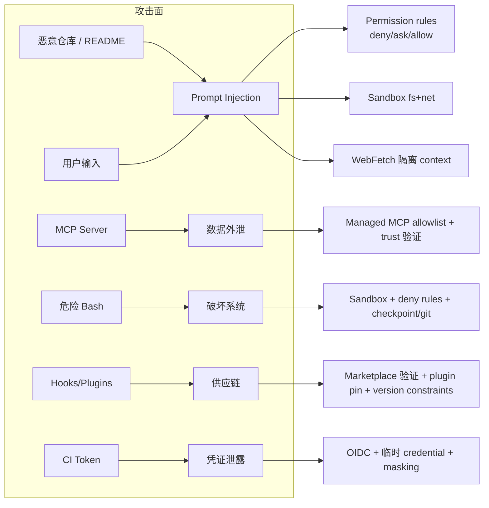

> 来源：Claude Code Cookbook · Part 39 · 原文标题：Part 39 — Security

> 本章是全书重点章节之一。它系统讲解 Claude Code 的安全基础、Prompt Injection 防护、MCP/Cloud/Remote Control 安全，以及完整 Threat Model。Permissions（Part 10）、Sandbox（Part 11）、Secure Profiles（Part 40）与本相关。
> 官方参考：[Security](https://code.claude.com/docs/en/security)、[Permissions](https://code.claude.com/docs/en/permissions)、[Sandboxing](https://code.claude.com/docs/en/sandboxing)、[Data usage](https://code.claude.com/docs/en/data-usage)、[Network configuration](https://code.claude.com/docs/en/network-config)

---

## 39.0 安全基础

Claude Code 照 Anthropic 的全面安全项目开发，有 SOC 2 Type 2 报告、ISO 27001 证书等（见 [Anthropic Trust Center](https://trust.anthropic.com)）。

**Permission-based architecture**：Claude Code 默认用严格只读权限。需要额外动作（编辑文件、跑测试、执行命令）时请求明确权限。用户控制是批准一次还是自动允许。Claude Code 在运行可修改系统的 Bash 命令前要求批准；一组内置只读命令（`ls`、`cat`、`git status` 等）免提示。

**内置保护**：

- **Sandboxed Bash tool**：文件系统和网络隔离。
- **Working directory boundary**：Claude Code 只能写启动它的文件夹及其子文件夹，不能无许可改父目录。目录外的 Read/Grep/Glob 需要批准提示。
- **Prompt fatigue mitigation**：allowlist 常用安全命令（按用户/代码库/组织）。
- **Accept Edits mode**：自动批准文件编辑和固定文件系统命令集。

**用户责任**：Claude Code 只有你授予它的权限。你有责任在批准前审查建议的代码和命令是否安全。

---

## 39.1 应对 Prompt Injection

Prompt Injection 是攻击者通过在文本里插入恶意内容、试图覆盖或操纵 AI 助手指令的技术。

### 39.1.1 核心保护

- **权限系统**：敏感操作需明确批准。
- **上下文感知分析**：分析完整请求检测潜在有害指令。
- **输入消毒**：处理用户输入防止命令注入。
- **网络命令批准**：`curl`、`wget` 默认不自动批准（像其他非只读 Bash 一样提示）。

### 39.1.2 额外防护

- **网络请求批准**：做网络请求的工具默认需批准。
- **隔离 context windows**：Web fetch 用独立 context window，避免注入恶意 prompt。
- **信任验证**：首次代码库运行和新 MCP servers 需要信任验证。注意：非交互 `-p` 时禁用信任验证；直接在 home 目录启动时信任仅当前会话不写盘。
- **命令注入检测**：可疑 bash 命令即使之前 allowlist 过也要求手动批准。
- **Fail-closed matching**：不匹配的命令默认转为手动批准。
- **安全凭证存储**：API key 和 token 尽量存 macOS Keychain，Windows/Linux 用文件权限保护。

### 39.1.3 与不可信内容协作的最佳实践

1. 批准前审查建议的命令。
2. 避免把不可信内容直接 pipe 给 Claude。
3. 验证对关键文件的建议改动。
4. 用 VM 跑脚本和工具调用（尤其与外部 web 服务交互时）。
5. 用 `/feedback` 报告可疑行为。

⚠️ 这些保护显著降低风险，但**没有系统完全免疫所有攻击**。用任何 AI 工具都要保持良好安全实践。

---

## 39.2 MCP 安全

- 允许的 MCP servers 列表在你的源代码（settings）里配置，工程师 check 进版本控制。
- 建议：自己写 MCP servers，或使用你信任的 provider。
- 可配置 Claude Code 的 MCP 权限。
- Anthropic 在加入 [Anthropic Directory](https://claude.ai/directory) 前按 listing criteria 审查 connectors，但**不 security-audit 或管理任何 MCP server**。

---

## 39.3 Cloud 执行安全

Claude Code on the web（Anthropic 托管环境）：

- **隔离 VM**：每个 cloud session 在隔离的 Anthropic 管理 VM 运行。
- **网络访问控制**：默认受限，可配置禁用或只允许特定域。
- **凭证保护**：通过安全代理，用沙箱内的 scoped credential，翻译成你实际的 GitHub 认证 token。
- **分支限制**：git push 限制在当前 working branch。
- **审计日志**：所有 cloud 操作记日志。
- **自动清理**：非活动一段时间后回收 session VM。

自托管环境：隔离、网络出口、git 凭证是你的部署责任（见 Part 42）。

**Remote Control**：web 界面连接到在你本地机器运行的 Claude Code 进程，代码执行和文件访问保持本地。连接用多个短命、窄 scope 的凭证，每个限定单一目的、独立过期，以限制单个被攻破凭证的爆炸半径。

---

## 39.4 团队与敏感代码

敏感代码工作：

- 批准前 review 所有建议改动。
- 敏感仓库用项目特定权限设置。
- 考虑用 dev container 额外隔离。
- 用 `/permissions` 定期审计权限设置。

团队安全：

- 用 managed settings 强制组织标准。
- 通过版本控制分享批准的权限配置。
- 培训团队成员安全实践。
- 用 OpenTelemetry metrics 监控 Claude Code 使用。
- 用 `ConfigChange` hooks 审计或阻止会话中的设置改动。

---

## 39.5 Secrets 处理（工程判断）

Claude Code 处理 secrets 的边界要点：

- **`.env` 读取**：可用 `Read(.env)` deny rules 阻止（Part 10）。
- **凭证存储**：API key/token 存 macOS Keychain、Windows/Linux 文件权限保护。
- **`~/.claude` 含 secrets**：设置放 user settings；project 设置 check 进源码控制时应避免放 secret values。
- **Cloud 凭证**：Cloud execution 用沙箱内 scoped credential 翻译成真实 token，不把真实 token 放进沙箱。
- **CI 凭证**（GitHub token 等）：CI 中 Claude 运行应最小 scope、临时凭证，见 Part 29。

---

## 39.6 Threat Model（完整）

基于前文各层建立威胁模型，把攻击面、威胁、缓解对应：

| 威胁 | 缓解 |
| --- | --- |
| **Prompt Injection**（恶意仓库/README/注释） | Permission system、WebFetch 隔离 context、trust 验证、fail-closed 匹配 |
| **危险 Shell**（误 `rm -rf`、format、push） | Permission deny、Sandbox、checkpoint+git 回滚、`rm -rf /` 熔断器 |
| **Secret 外泄**（`.env` 进日志/提交） | `Read(.env)` deny、`.gitignore`/`.claudeignore`、Secret scanning |
| **MCP 供应链**（恶意 server 读本地） | 库根 allowlist、Managed MCP、信任源、Anthropic Directory 审查 |
| **Hook/Plugin 供应链** | 验证来源、marketplace 验证、版本约束、pin commit |
| **WebDAV（Windows）** | 官方警告禁用 WebDAV 访问 `\\*`（绕过权限系统） |
| **CI Token 泄露** | OIDC、临时 credential、最小 scope、masking |
| **Cloud 数据** | 隔离 VM、网络控制、scoped credential、审计日志 |
| **Remote Control 凭证** | 多个短命窄 scope 凭证，独立过期 |

---

## 39.7 报告安全问题

发现 Claude Code 安全漏洞时：不要在公开处披露，通过 [HackerOne program](https://hackerone.com/4f1f16ba-10d3-4d09-9ecc-c721aad90f24/embedded_submissions/new) 报告，包含详细复现步骤，给处理时间。

---

## Official References

- [Security](https://code.claude.com/docs/en/security)
- [Permissions](https://code.claude.com/docs/en/permissions)
- [Sandboxing](https://code.claude.com/docs/en/sandboxing)
- [Sandbox environments](https://code.claude.com/docs/en/sandbox-environments)
- [Data usage](https://code.claude.com/docs/en/data-usage)
- [Network configuration](https://code.claude.com/docs/en/network-config)
- [Monitoring usage](https://code.claude.com/docs/en/monitoring-usage)
- [Security guidance plugin](https://code.claude.com/docs/en/security-guidance)
- [Anthropic Trust Center](https://trust.anthropic.com)
