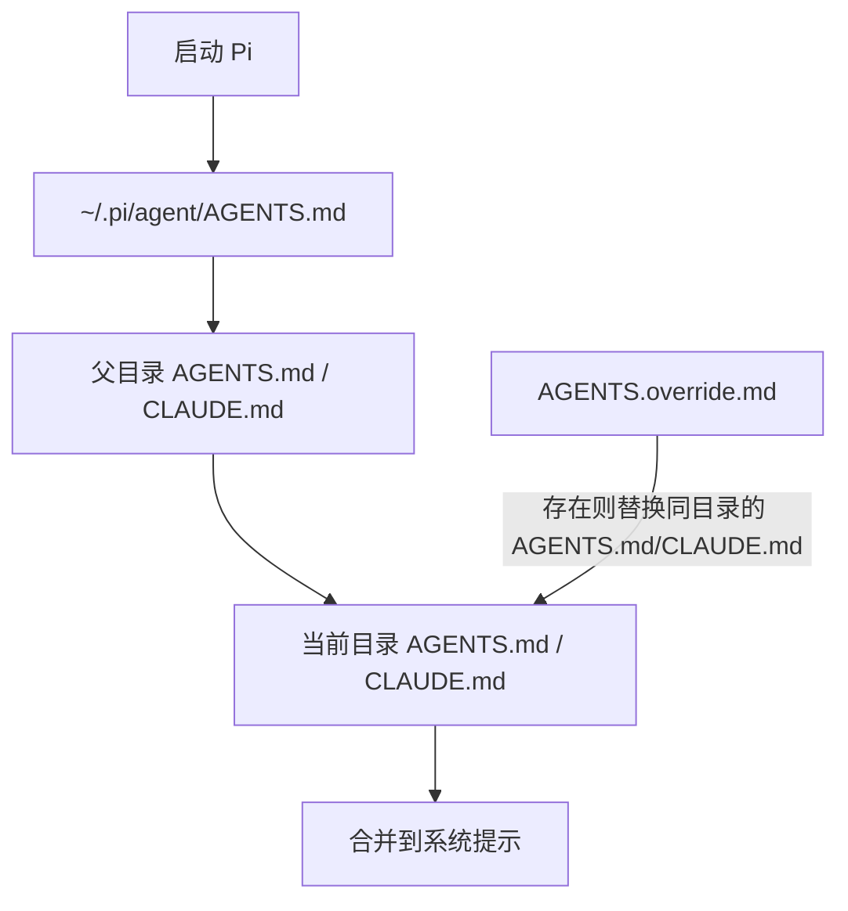

> 🟡 Builder 必读 | AGENTS.md 是给 AI 看的项目 README——把它写进项目根目录，Pi 启动时会自动把它加载进系统提示，免去每次重复说明。

## 加载顺序

Pi 按以下顺序查找并合并上下文文件：



> 注意：`AGENTS.override.md` 只替换同目录下的 `AGENTS.md` 或 `CLAUDE.md`，其他目录的上下文仍然正常加载。

---

## 最小示例

在项目根目录创建 `AGENTS.md`：

```markdown
# 项目说明

这是一个 Node.js 后端服务。

## 开发规则
- 使用 TypeScript，遵循 strict 模式
- 提交前必须运行 `npm run check`
- 不要在本地运行生产环境数据库迁移
- 保持回复简洁，优先给出代码和命令

## 常用命令
- `npm run dev`：启动开发服务器
- `npm run check`：运行 lint + typecheck + test
- `npm run build`：构建
```

创建后，重启 Pi 或输入 `/reload` 生效。

---

## 12 套 AGENTS.md 模板

### 1. 通用后端项目

```markdown
# 后端项目

- 使用 TypeScript，严格模式
- 优先写测试再改代码
- 每次修改后运行 `npm run check`
- 不要在本地运行生产迁移
```

### 2. 前端项目

```markdown
# 前端项目

- 技术栈：React + Vite + Tailwind CSS
- 组件使用函数式组件 + hooks
- 样式优先用 Tailwind 工具类
- 构建命令：`npm run build`
```

### 3. Python 数据项目

```markdown
# 数据项目

- 使用 Python 3.11+
- 依赖管理：poetry
- 数据处理用 pandas，可视化用 matplotlib
- 不要在根目录提交 CSV/Parquet 大文件
```

### 4. 个人学习助手

```markdown
# 学习助手

- 用简单的中文解释概念
- 每解释一个概念，举一个生活中的例子
- 我不懂的地方会追问，请耐心回答
```

### 5. 代码审查员

```markdown
# 代码审查员

- 审查代码时关注：正确性、可读性、性能、安全
- 每个问题给出：位置、原因、修复建议、风险等级
- 不要直接改代码，只给建议
```

### 6. 技术文档作者

```markdown
# 文档作者

- 用 Markdown 写作
- 每个功能包含：用途、示例、参数、返回值
- 代码示例必须可运行
- 使用简体中文
```

### 7. 安全审计员

```markdown
# 安全审计员

- 扫描代码中的：SQL 注入、XSS、路径遍历、硬编码密钥
- 每发现一个风险，给出：位置、利用场景、修复方案
- 不要运行任何可能破坏系统的命令
```

### 8. 测试工程师

```markdown
# 测试工程师

- 为每个新功能补全单元测试
- 使用项目已有的测试框架
- 运行 `npm test` 验证通过后再提交
```

### 9. DevOps / 运维助手

```markdown
# 运维助手

- 优先读取 Dockerfile、docker-compose.yml、CI 配置文件
- 修改配置前先备份
- 涉及生产环境的操作必须二次确认
```

### 10. 产品经理助手

```markdown
# 产品助手

- 把用户需求拆解为：用户故事、验收标准、优先级
- 输出格式用 Markdown 表格
- 技术实现细节只给概要
```

### 11. 开源贡献助手

```markdown
# 开源贡献助手

- 遵循项目的 CONTRIBUTING.md
- 提交信息用 conventional commits
- 修改前先运行已有测试
- 不要修改 LICENSE 和 AUTHORS
```

### 12. 全栈创业项目

```markdown
# 全栈项目

- 后端：Node.js + Express + Prisma
- 前端：Next.js + TypeScript
- 数据库：PostgreSQL
- 所有 API 修改必须同步更新前后端类型
- 提交前运行 `npm run check`
```

---

## SYSTEM.md 与 APPEND_SYSTEM.md

如果你想**完全替换**默认系统提示：

- 项目级：`.pi/SYSTEM.md`
- 全局：`~/.pi/agent/SYSTEM.md`

如果你想**追加**到默认系统提示：

- 项目级：`.pi/APPEND_SYSTEM.md`
- 全局：`~/.pi/agent/APPEND_SYSTEM.md`

> AGENTS.md 通常就够用了。SYSTEM.md 适合高级定制。

---

## 常见错误

| 错误 | 原因 | 修复 |
|------|------|------|
| AGENTS.md 没生效 | 没重启 Pi 或没 `/reload` | 创建后执行 `/reload` |
| 多个 AGENTS.md 冲突 | 父目录和当前目录都有 | 用 `AGENTS.override.md` 精确控制 |
| 内容太长被截断 | 上下文超限 | 精简规则，用分章节方式 |

---

## 你现在应该会什么

到这里你应该能：

- 区分 `AGENTS.md`、`CLAUDE.md`、`AGENTS.override.md` 的加载优先级
- 为自己的项目写一份最小可用的 AGENTS.md（5 条以内）
- 知道 `SYSTEM.md` 和 `APPEND_SYSTEM.md` 是在什么场景下才需要碰的

## 下一步

- [05-tools.md](./tools.md) — 内置工具与 read-only 模式
- [09-development-workflow.md](./development-workflow.md) — 把 AGENTS.md 用到开发工作流里
