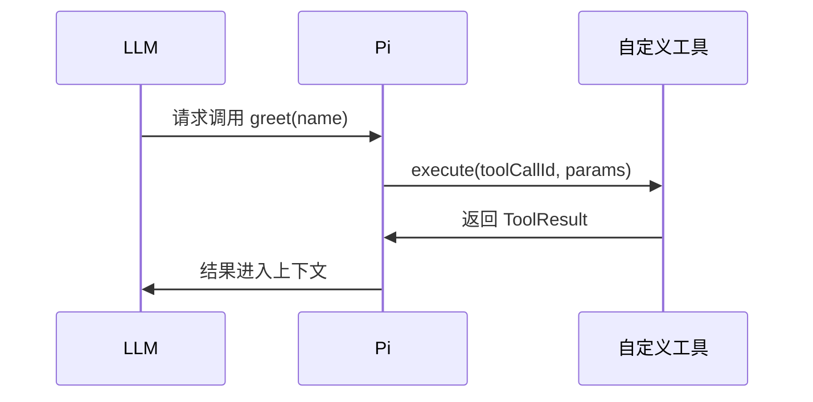

> 🔴 开发者章节 | 当 `read / write / edit / bash` 不够用时，自定义工具是第一个想到的扩展方式。本章讲怎么写一个能被 LLM 调用、并把结果安全地喂回上下文的工具。

## 一句话

> 自定义工具 = TypeScript 函数 + Typebox 参数 + `pi.registerTool()`。

---

## 最小示例



```typescript
import type { ExtensionAPI } from "@earendil-works/pi-coding-agent";
import { Type } from "typebox";

export default function (pi: ExtensionAPI) {
  pi.registerTool({
    name: "greet",
    label: "Greet",
    description: "Greet someone by name",
    parameters: Type.Object({
      name: Type.String({ description: "Name to greet" }),
    }),
    async execute(toolCallId, params, signal, onUpdate, ctx) {
      return {
        content: [{ type: "text", text: `Hello, ${params.name}!` }],
        details: {},
      };
    },
  });
}
```

LLM 看到：`greet(name)` — 打招呼。

---

## 工具定义字段

| 字段 | 是否必填 | 说明 |
|------|----------|------|
| `name` | ✅ | 工具名（唯一） |
| `label` | 推荐 | 人类可读名称 |
| `description` | ✅ | LLM 看到的功能描述 |
| `parameters` | ✅ | Typebox schema |
| `promptSnippet` | 推荐 | 系统提示里一行摘要 |
| `promptGuidelines` | 可选 | 系统提示追加规则 |
| `prepareArguments` | 可选 | 校验前参数兼容转换 |
| `execute` | ✅ | 执行函数 |
| `renderCall` | 可选 | 自定义 TUI 调用展示 |
| `renderResult` | 可选 | 自定义 TUI 结果展示 |

> ⚠️ 重要：`promptGuidelines` 里没有工具名前缀，所以每条规则必须显式写工具名，例如 “Use my_tool when...”。

---

## execute 签名

```typescript
async execute(
  toolCallId: string,
  params: Static<typeof parameters>,
  signal: AbortSignal | undefined,
  onUpdate: (result: Partial<ToolResult>) => void,
  ctx: ExtensionContext,
): Promise<ToolResult>
```

返回值：

```typescript
{
  content: TextContent[];
  details?: object;           // 给渲染器和状态恢复
  usage?: ModelUsage;         // 嵌套 LLM 用量
  terminate?: boolean;        // 是否跳过自动下一轮
}
```

错误处理：**必须 throw Error** 才会标记 `isError: true`；普通返回不会报错。

```typescript
if (!isValid(params)) {
  throw new Error(`Invalid input: ${JSON.stringify(params)}`);
}
```

---

## 参数类型最佳实践

- 字符串枚举用 `StringEnum`：

```typescript
import { StringEnum } from "@earendil-works/pi-ai";

parameters: Type.Object({
  action: StringEnum(["list", "add", "delete"] as const),
})
```

> Google API 不支持 `Type.Union(Type.Literal(...))`，必须用 `StringEnum`。

- 可选字段用 `Type.Optional()`：

```typescript
Type.Object({
  text: Type.Optional(Type.String()),
})
```

---

## 流式更新

长时间运行的工具可以发中间进度：

```typescript
async execute(toolCallId, params, _signal, onUpdate) {
  onUpdate?.({
    content: [{ type: "text", text: "正在下载..." }],
    details: { progress: 30 },
  });

  // ... 执行中 ...

  onUpdate?.({
    content: [{ type: "text", text: "下载完成" }],
    details: { progress: 100 },
  });

  return {
    content: [{ type: "text", text: "Done" }],
    details: {},
  };
}
```

---

## 输出截断

工具输出必须截断，否则可能撑爆上下文。

```typescript
import {
  truncateHead,
  truncateTail,
  formatSize,
  DEFAULT_MAX_BYTES,
  DEFAULT_MAX_LINES,
} from "@earendil-works/pi-coding-agent";
import { writeFile } from "node:fs/promises";
import { tmpdir } from "node:os";
import { join } from "node:path";

// 按场景选择保留头部或尾部
const truncation = truncateHead(output, {
  maxLines: DEFAULT_MAX_LINES,
  maxBytes: DEFAULT_MAX_BYTES,
});

let text = truncation.content;
if (truncation.truncated) {
  // 把完整输出写到临时文件，并把路径附加到返回结果中
  const fullPath = join(tmpdir(), `pi-tool-output-${toolCallId}.txt`);
  await writeFile(fullPath, output, "utf8");
  text += `\n\n[输出已截断：${truncation.outputLines}/${truncation.totalLines} 行（${formatSize(truncation.totalBytes)}），完整输出见 ${fullPath}]`;
}

return { content: [{ type: "text", text }] };
```

- `truncateHead`：保留开头（适合搜索、文件内容）
- `truncateTail`：保留结尾（适合日志）
- 默认上限：50KB 或 2000 行

---

## 文件修改工具一定要用队列

如果自定义工具会改文件，务必用 `withFileMutationQueue`，避免和内置 `edit`/`write` 并发冲突。

```typescript
import { withFileMutationQueue } from "@earendil-works/pi-coding-agent";
import { mkdir, readFile, writeFile } from "node:fs/promises";
import { dirname, resolve } from "node:path";

async execute(toolCallId, params, _signal, _onUpdate, ctx) {
  const absolutePath = resolve(ctx.cwd, params.path);

  return withFileMutationQueue(absolutePath, async () => {
    await mkdir(dirname(absolutePath), { recursive: true });
    const current = await readFile(absolutePath, "utf8");
    const next = current.replace(params.oldText, params.newText);
    await writeFile(absolutePath, next, "utf8");

    return {
      content: [{ type: "text", text: `Updated ${params.path}` }],
      details: {},
    };
  });
}
```

---

## 覆盖内置工具

你可以用同名工具覆盖内置的 `read`、`bash`、`edit` 等：

```typescript
pi.registerTool({
  name: "read",
  label: "Read",
  description: "Read file with access log",
  parameters: Type.Object({ path: Type.String() }),
  async execute(toolCallId, params) {
    console.log(`Reading: ${params.path}`);
    // ...
  },
});
```

启动：

```bash
pi -e ./tool-override.ts
```

> 只覆盖实现不覆盖渲染：如果 `renderCall`/`renderResult` 不传，仍使用内置渲染。

也可以用 `--no-builtin-tools`：

```bash
pi --no-builtin-tools -e ./my-extension.ts
```

---

## 动态加载工具

Pi 支持"先注册、后激活"：

1. 注册所有工具
2. 初始只激活一部分
3. 工具执行中用 `pi.setActiveTools()` 纯增加激活的工具

这样 Anthropic / OpenAI 新模型可利用原生 deferred loading，减少提示前缀变化。

```typescript
const SEARCHABLE = new Set(["lookup_weather", "search_issues"]);

pi.registerTool({ name: "lookup_weather", ... });
pi.registerTool({ name: "search_issues", ... });
pi.registerTool({
  name: "search_tools",
  description: "Search for and enable tools relevant to a task",
  parameters: Type.Object({ query: Type.String() }),
  async execute(toolCallId, params) {
    const matches = findTools(params.query);
    const active = pi.getActiveTools();
    const added = matches.filter((n) => !active.includes(n));
    pi.setActiveTools([...new Set([...active, ...added])]);
    return { content: [{ type: "text", text: `Loaded: ${added.join(", ")}` }], details: {} };
  },
});

pi.on("session_start", () => {
  const initial = pi.getActiveTools().filter((n) => !SEARCHABLE.has(n));
  pi.setActiveTools([...new Set([...initial, "search_tools"])]);
});
```

---

## 状态持久化

把状态写入 `details`，重启后从 session 恢复：

```typescript
let items: string[] = [];

pi.on("session_start", async (_event, ctx) => {
  items = [];
  for (const entry of ctx.sessionManager.getBranch()) {
    if (entry.type === "message" && entry.message.role === "toolResult" && entry.message.toolName === "my_tool") {
      items = entry.message.details?.items ?? [];
    }
  }
});

pi.registerTool({
  name: "my_tool",
  // ...
  async execute(toolCallId, params) {
    items.push(params.text);
    return {
      content: [{ type: "text", text: "Added" }],
      details: { items: [...items] },
    };
  },
});
```

---

## 你现在应该会什么

到这里你应该能：

- 写出带 Typebox schema + `promptSnippet` + `promptGuidelines` 的标准自定义工具
- 处理错误（`throw` 才会被标记 `isError`）、流式更新（`onUpdate`）、输出截断（`truncateHead` / `truncateTail`）
- 用 `withFileMutationQueue` 解决自定义工具和内置 `edit`/`write` 的并发写冲突
- 区分"覆盖内置工具"和"用 `--no-builtin-tools` 完全替换"的两种用法

## 下一步

- [个人 Agent 配置](../personal-agents/) — 个人 Agent 配置
- [多 Agent 编排](../multi-agent/) — 多 Agent 协作
