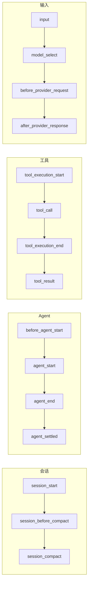

> 🔴 开发者章节 | 扩展是 Pi 留出来的"可编程接缝"——TypeScript 文件，可以监听事件、注册工具 / 命令 / Provider、修改 UI、拦截工具调用。比 Pi 内置的工具集更广，能做内置功能刻意没做的事。

## 一句话

> Pi 的扩展是 TypeScript 文件，可以监听事件、注册自定义工具、注册命令、控制 UI、管理状态，是 Pi 最强的定制能力。

---

## 扩展能做什么

✅ Pi 原生支持：

| 能力 | 用法 |
|------|------|
| 监听事件 | `pi.on("session_start", ...)`、`pi.on("tool_call", ...)` |
| 注册自定义工具 | `pi.registerTool({...})` |
| 注册命令 | `pi.registerCommand("hello", {...})` |
| 用户交互 | `ctx.ui.confirm()` / `ctx.ui.select()` / `ctx.ui.notify()` |
| 修改工具参数 | `tool_call` 事件里 `event.input` 可改 |
| 拦截危险操作 | `return { block: true }` |
| 自定义 TUI | `ctx.ui.custom()`、`setStatus`、`setWidget`、`setFooter` |
| 会话持久化 | `pi.appendEntry()` |
| 快捷键 | `pi.registerShortcut("ctrl+shift+p", ...)` |
| CLI Flag | `pi.registerFlag("plan", {...})` |
| 动态 Provider | `pi.registerProvider(...)` |

---

## 扩展位置（自动发现）

```
~/.pi/agent/extensions/*.ts          # 全局
~/.pi/agent/extensions/*/index.ts    # 全局（目录形式）
.pi/extensions/*.ts                  # 项目本地（需信任）
.pi/extensions/*/index.ts            # 项目本地（目录形式）
```

> 项目本地扩展只有在项目被信任后才会加载。

### 通过 settings.json 加载额外路径

```json
{
  "packages": [
    "npm:@foo/bar@1.0.0",
    "git:github.com/user/repo@v1"
  ],
  "extensions": [
    "/path/to/local/extension.ts",
    "/path/to/local/extension/dir"
  ]
}
```

### 临时测试用 -e

```bash
pi -e ./my-extension.ts
```

> 建议：正式扩展放到自动发现目录，才能 `/reload` 热重载。

---

## 写第一个扩展

创建 `~/.pi/agent/extensions/hello.ts`：

```typescript
import type { ExtensionAPI } from "@earendil-works/pi-coding-agent";
import { Type } from "typebox";

export default function (pi: ExtensionAPI) {
  // 1. 监听事件
  pi.on("session_start", async (_event, ctx) => {
    ctx.ui.notify("Hello Extension loaded!", "info");
  });

  // 2. 拦截危险命令
  pi.on("tool_call", async (event, ctx) => {
    if (event.toolName === "bash" && event.input.command?.includes("rm -rf")) {
      const ok = await ctx.ui.confirm("危险操作", "允许执行 rm -rf 吗？");
      if (!ok) return { block: true, reason: "Blocked by user" };
    }
  });

  // 3. 注册工具
  pi.registerTool({
    name: "greet",
    label: "Greet",
    description: "Greet someone by name",
    parameters: Type.Object({
      name: Type.String({ description: "Name to greet" }),
    }),
    async execute(toolCallId, params) {
      return {
        content: [{ type: "text", text: `Hello, ${params.name}!` }],
        details: {},
      };
    },
  });

  // 4. 注册命令
  pi.registerCommand("hello", {
    description: "Say hello",
    handler: async (args, ctx) => {
      ctx.ui.notify(`Hello ${args || "world"}!`, "info");
    },
  });
}
```

启动 Pi，输入 `/hello`，看效果。

---

## 事件系统（Events）

Pi 扩展的核心是事件。常用事件分组：



常用事件分组：

### 启动与会话

| 事件 | 触发时机 |
|------|----------|
| `project_trust` | 项目信任决策前 |
| `session_start` | 会话启动/恢复/分叉 |
| `resources_discover` | 资源发现时（startup/reload） |
| `session_before_switch` | `/new` 或 `/resume` 前 |
| `session_before_fork` | `/fork` 或 `/clone` 前 |
| `session_before_compact` | 压缩前（可自定义摘要） |
| `session_compact` | 压缩后 |
| `session_before_tree` | `/tree` 导航前 |
| `session_tree` | `/tree` 导航后 |
| `session_shutdown` | 会话销毁前（清理资源） |
| `session_info_changed` | 会话重命名 |

### Agent 生命周期

| 事件 | 触发时机 |
|------|----------|
| `before_agent_start` | 用户提交后、Agent 循环前 |
| `agent_start` | 底层 Agent 运行开始 |
| `agent_end` | 底层 Agent 运行结束（可能还有重试） |
| `agent_settled` | 真正结束（无重试/无排队） |
| `turn_start` / `turn_end` | 每一轮 LLM + 工具调用 |
| `message_start` / `message_update` / `message_end` | 消息生命周期 |

### 工具事件

| 事件 | 触发时机 |
|------|----------|
| `tool_execution_start` | 工具执行前 |
| `tool_call` | 工具调用前（可拦截/修改参数） |
| `tool_execution_update` | 工具执行中（流式更新） |
| `tool_result` | 工具执行后（可修改结果） |
| `tool_execution_end` | 工具执行结束 |

### 输入与模型

| 事件 | 触发时机 |
|------|----------|
| `input` | 用户输入后、命令展开前（可拦截/改写） |
| `model_select` | 模型切换 |
| `thinking_level_select` | 思考等级切换 |
| `before_provider_headers` | HTTP 请求头发送前 |
| `before_provider_request` | Provider payload 发送前 |
| `after_provider_response` | HTTP 响应接收后 |

> 想改写"发给模型的整段上下文"？Pi 没有单独叫 `context` 的事件。对应需求通常落到 `before_agent_start`（在 Agent 循环开始前修改初始消息）或 `message_update`/`message_end`（在流式生成过程中干预）。改写工具入参最直接的钩子是 `tool_call`，文档明确说 `event.input` 上的修改会被 Pi 直接应用到执行阶段，不会再校验一次。

### 用户 Bash

| 事件 | 触发时机 |
|------|----------|
| `user_bash` | 用户输入 `!` 或 `!!` 命令时 |

---

## 扩展示例

### 示例 1：拦截危险命令

```typescript
export default function (pi: ExtensionAPI) {
  pi.on("tool_call", async (event, ctx) => {
    if (event.toolName === "bash") {
      const cmd = event.input.command || "";
      if (cmd.includes("rm -rf") || cmd.includes("sudo")) {
        const ok = await ctx.ui.confirm("危险命令", `执行：${cmd}？`);
        if (!ok) return { block: true, reason: "用户拒绝" };
      }
    }
  });
}
```

### 示例 2：会话开始时显示项目信息

```typescript
export default function (pi: ExtensionAPI) {
  pi.on("session_start", async (_event, ctx) => {
    const file = ctx.sessionManager.getSessionFile();
    ctx.ui.setStatus("my-ext", `会话：${file ?? "临时"}`);
  });
}
```

### 示例 3：注册一个"待办事项"工具

```typescript
import { Type } from "typebox";

export default function (pi: ExtensionAPI) {
  let todos: string[] = [];

  pi.registerTool({
    name: "todo",
    label: "Todo",
    description: "Manage todo list",
    parameters: Type.Object({
      action: Type.Union([Type.Literal("add"), Type.Literal("list")]),
      text: Type.Optional(Type.String()),
    }),
    async execute(toolCallId, params) {
      if (params.action === "add" && params.text) {
        todos.push(params.text);
      }
      return {
        content: [{ type: "text", text: JSON.stringify(todos) }],
        details: { todos: [...todos] },
      };
    },
  });
}
```

---

## 常用 ExtensionAPI 方法

| 方法 | 用途 |
|------|------|
| `pi.on(event, handler)` | 订阅事件 |
| `pi.registerTool(def)` | 注册工具 |
| `pi.registerCommand(name, opts)` | 注册命令 |
| `pi.registerShortcut(key, opts)` | 注册快捷键 |
| `pi.registerFlag(name, opts)` | 注册 CLI flag |
| `pi.registerProvider(name, config)` | 注册模型 Provider |
| `pi.sendMessage(msg, opts)` | 注入自定义消息 |
| `pi.sendUserMessage(content, opts)` | 发送用户消息 |
| `pi.appendEntry(type, data)` | 持久化扩展数据 |
| `pi.setSessionName(name)` | 设置会话名 |
| `pi.setLabel(entryId, label)` | 给条目打标签 |
| `pi.getCommands()` | 列出当前可用命令 |
| `pi.exec(cmd, args, opts)` | 执行 shell 命令 |
| `pi.getActiveTools()` / `setActiveTools()` | 管理激活工具 |
| `pi.setModel(model)` | 切换模型 |
| `pi.getThinkingLevel()` / `setThinkingLevel()` | 思考等级 |
| `pi.events` | 扩展间事件总线 |

---

## ExtensionContext（ctx）

所有事件处理器都收到 `ctx`：

| 属性 | 用途 |
|------|------|
| `ctx.ui` | UI 交互（select/confirm/input/notify/editor/custom） |
| `ctx.mode` | 当前模式：`"tui"` / `"rpc"` / `"json"` / `"print"` |
| `ctx.hasUI` | 是否有 UI |
| `ctx.cwd` | 当前工作目录 |
| `ctx.isProjectTrusted()` | 项目是否被信任 |
| `ctx.sessionManager` | 只读会话状态 |
| `ctx.model` / `ctx.modelRegistry` | 当前模型与注册表 |
| `ctx.thinkingLevel` | 当前思考等级 |
| `ctx.scopedModels` | 当前会话可用模型 |
| `ctx.signal` | 当前 AbortSignal |
| `ctx.isIdle()` / `ctx.abort()` | 控制流 |
| `ctx.shutdown()` | 请求优雅退出 |
| `ctx.getContextUsage()` | 当前 token 用量 |
| `ctx.compact(opts)` | 触发压缩 |
| `ctx.getSystemPrompt()` | 当前系统提示 |

---

## 错误处理

- 扩展抛错：会被记录，Agent 继续运行
- `tool_call` 抛错：工具被拦截（fail-safe）
- 工具执行报错：`throw new Error(...)`，会被标记 `isError: true` 并报告给 LLM

---

## 调试技巧

```bash
# 看扩展加载日志
pi --verbose

# 临时测试扩展
pi -e ./my-extension.ts

# 热重载
/reload
```

---

## 常见错误

| 症状 | 原因 | 修复 |
|------|------|------|
| 扩展没加载 | 没放到自动发现目录且没用 `-e` | 移到 `~/.pi/agent/extensions/` |
| 项目本地扩展没生效 | 项目未被信任 | `/trust` 或启动时确认 |
| `/reload` 后改动没生效 | 代码有缓存 | 重启 Pi 或检查 `jiti` 缓存 |
| 工具注册后 LLM 不调用 | `promptSnippet` 没写 | 补充 `promptSnippet` 与 `promptGuidelines` |
| `ctx.ui.confirm` 没反应 | `ctx.hasUI === false` | 检查模式（print/json 无 UI） |

---

## 你现在应该会什么

到这里你应该能：

- 解释 Pi 的事件生命周期（启动 / 会话 / Agent 循环 / 工具 / 输入），并指出每个阶段可以挂哪些钩子
- 写一个最小扩展：监听 `session_start` + 拦截 `tool_call` + 注册 `pi.registerTool`
- 用 `ctx.ui.*` 在 TUI 里弹出通知 / 选择 / 确认
- 用 `pi --verbose` 与 `/reload` 调试扩展加载问题

## 下一步

- [12-custom-tools.md](./custom-tools.md) — 自定义工具开发
- [13-personal-agents.md](./personal-agents.md) — 个人 Agent 工作流
