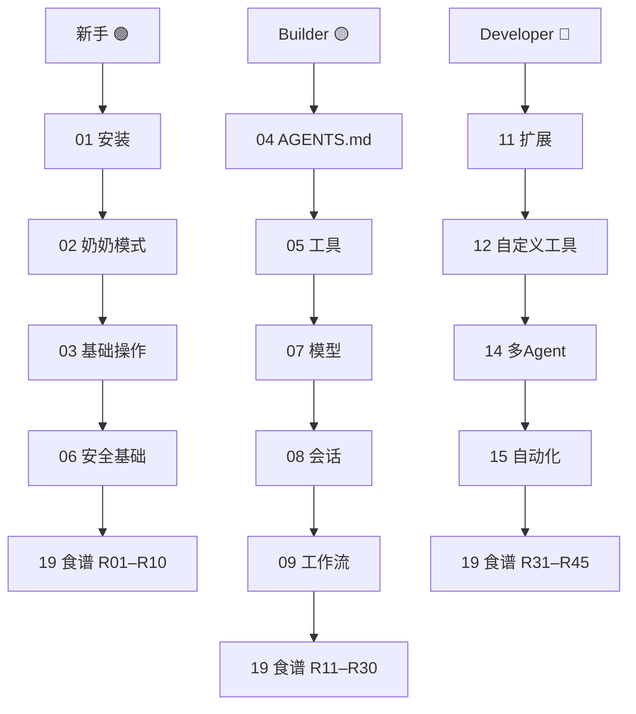

> 🟢 新手起点 | 本章不讲命令，只讲“Pi 到底能干什么、不能干什么”。

## 一句话定义

Pi 是一个 **本地终端里的编码 Agent（Coding Agent）**。它在你自己的电脑上运行，直接读你的文件、执行命令、帮你写代码。它不是浏览器插件，也不是在线聊天窗口——它就是一个你敲命令就能跑起来的“智能助手”。

---

## 为什么你会想用 Pi

你正在：

- 面对一个陌生的代码库，想让它“先给我讲讲结构”
- 有一堆文件要整理、重命名、检查，但不想一个个手动改
- 写代码时卡在“这个函数该怎么写”上，想要一个会看上下文的帮手
- 做数据分析、日志排查、文档整理，想让 AI 直接读你本地的文件
- 搭建自动化流程，希望有一个“可编程的 AI 大脑”

Pi 在这些场景里就是 **本地版 Copilot + Shell + 文件管理器** 的组合体。

---

## Pi 不是什么

| ❌ 不是 | ✅ 而是 |
|----------|----------|
| 云端 IDE | 本地 CLI 工具，没有图形界面 |
| 黑盒聊天机器人 | 可见每一步操作、可打断、可审查的 Agent |
| 全自动 AI | 需要你给指令、审查结果、做决策 |
| 只能写代码 | 也能写文档、分析数据、整理文件、做研究 |

---

## 三种难度等级

本书使用图标区分内容难度，你可以按自己的节奏选择：

| 图标 | 含义 | 阅读建议 |
|------|------|----------|
| 🟢 Beginner | 零门槛，不需要编程经验 | 直接照做，不需要懂原理 |
| 🟡 Builder | 需要一点技术背景，但不需要写底层代码 | 学会配置、AGENTS.md、工作流 |
| 🔴 Developer | 需要 TypeScript / Node.js / 扩展开发经验 | 写自定义工具、SDK、多 Agent 编排 |

> 建议：即使是 🔴 开发者，也先读 🟢 第 2 章，因为它会告诉你 Pi 的“心智模型”。

---

## Pi 的核心设计原则

官方文档明确写出的几条设计哲学（见 [Using Pi → Design Principles](https://pi.dev/docs/latest/usage)）：

1. **核心小而精**：默认启用 `read / write / edit / bash` 四个工具，内置还有 `grep / find / ls` 但默认关闭，其余能力全部留给扩展。
2. **没有内置“权限弹窗”**：Pi 默认信任你当前目录，安全责任明确地落在用户身上。
3. **没有内置沙箱**：Pi 会用你的用户权限执行命令。如果你想隔离，用 Docker、Gondolin（官方 examples 扩展）或 NVIDIA OpenShell（🔧 外部方案）。
4. **可编程**：通过 Extensions、Skills、Prompt Templates、Packages 来定制，而不是内置一堆你不需要的功能。

> ⚠️ 特别说明：**MCP（Model Context Protocol）当前官方版本未提供该能力。** 如果你需要 MCP 协议，需要自己写扩展桥接，或者等官方支持。

---

## 读者路径

---

## 你已经知道的事（可跳过）

如果你之前用过 Claude Code、Cursor、Windsurf，Pi 在交互层面会让你有似曾相识的感觉——但有几个底层差异值得一开始就注意到：

- Pi 是一个终端程序，不是 VS Code 插件
- Pi 不内置“自动提交 PR”“代码索引”这些 IDE 闭环功能
- Pi 的自定义入口是 `.pi/extensions/*.ts`，不是 GUI 配置面板

这些差异不是为了分高下，是因为 Pi 的设计取舍很清晰：把“好用的部分”做小，把“可定制的部分”交还给用户。后面每一章都在用不同的方式印证这一点。

---

## 下一步

- [安装 Pi](../installation/) — 安装 Pi
- [奶奶模式：零门槛第一次对话](../beginner-mode/) — 零门槛第一次对话
