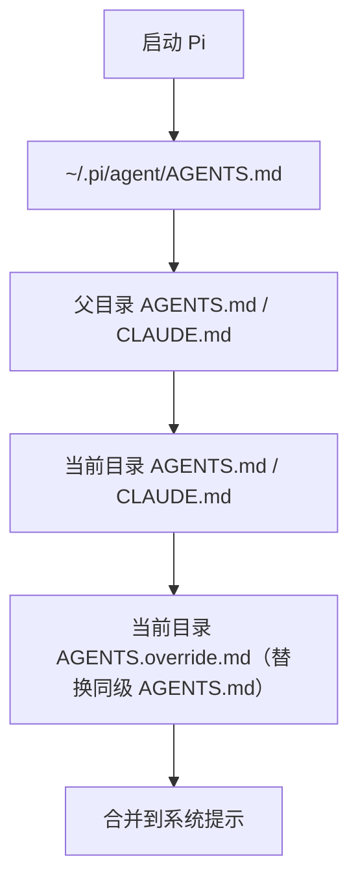

> 🟡 Builder 必读 | Pi 的会话不是一串单调的问答，而是带分叉的树。本章解释会话怎么存、怎么回、怎么压——以及哪些"长期记忆"不是 Pi 内置的，要靠你自己搭。

## 会话存储位置

所有会话保存在：

```
~/.pi/agent/sessions/
```

按工作目录（cwd）分目录存放，每个会话是一个 JSONL 文件。

你可以用以下方式改变存储位置（优先级从高到低）：

1. `--session-dir <dir>`
2. `PI_CODING_AGENT_SESSION_DIR` 环境变量
3. `settings.json` 里的 `sessionDir`

---

## 会话树（Session Tree）

Pi 的会话不是简单的“一条线”，而是一棵树。你可以在任何一条用户消息处分叉（fork），生成新的分支。

```mermaid
graph TD
    A[用户消息 1] --> B[助手回复 1]
    B --> C[用户消息 2]
    C --> D[助手回复 2]
    C --> E[/fork 从这里分叉]
    E --> F[助手回复 2']
    F --> G[用户消息 3']
```

### 查看会话树

```
/tree
```

在树里可以：

- 跳转到任意节点继续对话
- 给分支打标签（branch summary）
- 折叠/展开工具调用

---

## 分叉与复制

| 命令 | 作用 |
|------|------|
| `/fork` | 从当前选中用户消息创建新会话 |
| `/clone` | 把当前分支完整复制到新会话文件 |

命令行：

```bash
pi --fork <path|id>
pi --session <path|id>
```

---

## 压缩（Compaction）

当上下文太长时，Pi 会自动压缩旧消息，只保留摘要。

### 自动压缩

默认开启，规则：

- 触发条件：`contextTokens > contextWindow - reserveTokens`
- `reserveTokens` 默认 16384
- `keepRecentTokens` 默认 20000

配置：

```json
{
  "compaction": {
    "enabled": true,
    "reserveTokens": 16384,
    "keepRecentTokens": 20000
  }
}
```

### 手动压缩

```
/compact
```

或带指令：

```
/compact 保留所有 API 相关代码，删除测试输出
```

---

## 长期记忆

Pi 没有内置“记忆数据库”，但你可以通过以下方式实现：

1. **AGENTS.md**：写入项目规则、常用命令、技术栈
2. **命名会话**：`pi --name "客户A需求分析"`，方便 `/resume` 找回
3. **导出会话**：`/export` 保存为 HTML 或 JSONL，长期归档
4. **Skill / Prompt Template**：把常用指令封装成可复用模板

---

## 上下文文件加载顺序



---

## 常见错误

| 症状 | 原因 | 修复 |
|------|------|------|
| `/resume` 找不到会话 | 会话被删或目录变了 | 检查 `~/.pi/agent/sessions/` |
| 上下文突然清空 | 自动压缩触发 | `/tree` 找回历史，或调大 `keepRecentTokens` |
| 分叉后内容重复 | 在错误节点 fork | `/tree` 里选对节点再 fork |
| 会话文件损坏 | 手动编辑 JSONL | 用 `--session` 指定备份文件 |

---

## 你现在应该会什么

到这里你应该能：

- 解释"会话"和"上下文"为什么不是一回事
- 用 `/tree` / `/fork` / `/clone` 在一条会话里分叉探索
- 调整 `compaction.reserveTokens` / `keepRecentTokens` 控制自动压缩节奏
- 用 AGENTS.md + 命名会话 + 导出 JSONL 拼出一个能跨会话复用的事实基线

## 下一步

- [09-development-workflow.md](./development-workflow.md) — 把会话管理用到开发流程
- [10-prompt-engineering.md](./prompt-engineering.md) — 提示模板
