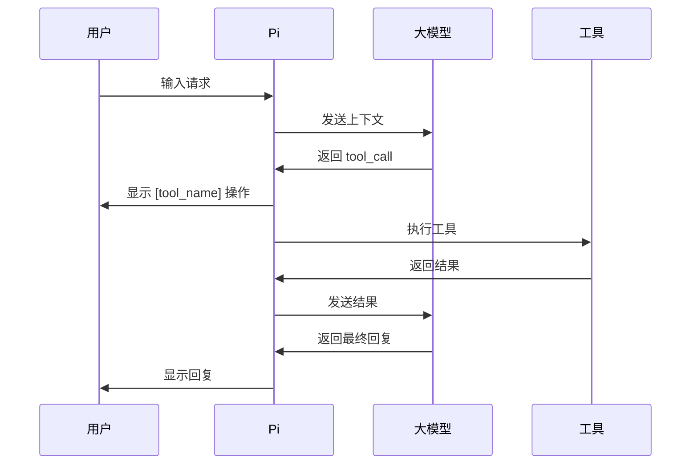

> 🟡 Builder 必读 | 本章讲 Pi 的内置工具、如何启用只读工具、如何控制工具权限。

## 内置工具一览

官方文档把以下 7 个工具列为 Pi 的内置工具（built-in tools）：`read`、`bash`、`edit`、`write`、`grep`、`find`、`ls`。其中 `read / write / edit / bash` 在 [quickstart](https://pi.dev/docs/latest/quickstart) 中被列为"默认启用"，`grep / find / ls` 同为内置但默认不开启，需要通过 `--tools` 等方式显式打开。

| 工具 | 作用 | 默认 |
|------|------|------|
| `read` | 读取文件内容 | ✅ 启用 |
| `write` | 创建或覆盖文件 | ✅ 启用 |
| `edit` | 修改文件（精确替换） | ✅ 启用 |
| `bash` | 执行 shell 命令 | ✅ 启用 |
| `grep` | 搜索文件内容 | ❌ 需启用 |
| `find` | 查找文件 | ❌ 需启用 |
| `ls` | 列出目录内容 | ❌ 需启用 |

---

## 启用只读工具

### 交互模式

```bash
pi --tools read,grep,find,ls
```

### 配置文件

settings.json 目前**没有**官方文档化的 `defaultTools` 字段。要让 `grep / find / ls` 永久生效，最稳妥的方式是在 shell 别名或启动脚本里封装 `pi --tools read,grep,find,ls`，而不是写一个看似正确但没人背书的配置项。如果你看到的教程里写着：

```json
{
  "defaultTools": ["read", "grep", "find", "ls"]
}
```

请注意这是**未经验证的写法**，以官方 [Usage](https://pi.dev/docs/latest/usage) 和 [Settings](https://pi.dev/docs/latest/settings) 为准。

---

## Read-only 模式

如果你只想让 Pi 分析代码，不要它改任何文件，启动时加上：

```bash
pi --tools read,grep,find,ls -p "Review this codebase"
```

这样 Pi 只有读和搜索能力，不会调用 `write`、`edit`、`bash`。

---

## 禁用指定工具

```bash
pi --exclude-tools bash -p "Summarize this code"
```

这条命令保留 read/write/edit，但禁止执行 bash。

---

## 禁用所有内置工具

```bash
pi --no-builtin-tools -p "Explain this concept"
```

适合纯对话场景。

---

## 工具调用流程



---

## 自定义工具（预告）

Pi 允许通过 **Extensions** 注册自定义工具，比如天气查询、公司 API 查询、数据库操作等。

详细见：

- [扩展架构](../extensions/) — 扩展架构
- [用 TypeScript 写自定义工具](../custom-tools/) — 写自定义工具

---

## 常见错误

| 症状 | 原因 | 修复 |
|------|------|------|
| Pi 说找不到文件 | `ls` 未启用或路径错 | 启用 `--tools read,ls` 或检查路径 |
| Pi 无法搜索代码 | `grep` 未启用 | 启用 `--tools read,grep,find,ls` |
| Pi 误删文件 | 给了 write 权限 | read-only 模式复查 |
| bash 命令卡住 | 命令进入交互模式等输入 | 给原命令加非交互参数（如 `apt-get -y`、`npm -y`、`pip -q`），或用 `shellCommandPrefix` |

> Pi 没有 `-y` / `-q` 这种"自动确认"开关——这是被调用方的参数。如果你的项目里经常需要自动确认，配置 `settings.json` 里的 `shellCommandPrefix` 会更稳。

---

## 下一步

- [安全：Trust ≠ Sandbox](../security/) — 安全：Trust ≠ Sandbox
- [扩展架构](../extensions/) — 自定义工具与扩展
